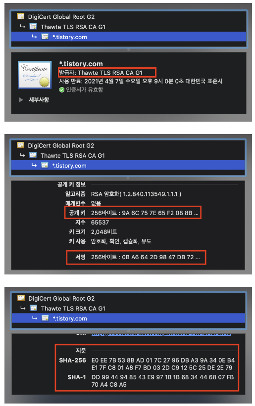
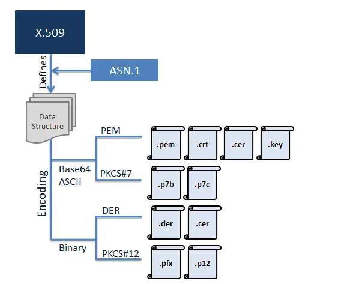
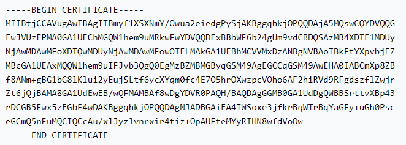
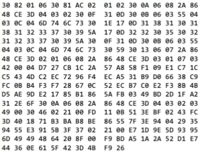

# CA

## Certificate(인증서)란 ?
```
우선 인증기관에 대해 알기 전에 인증서에 대해 알아야 한다.

디지털 인증서는 공개 키 암호화 시스템에서 사용되는 중요한 보안 요소로, 특정한 엔터티의 공개 키와 해당 엔터티의 신원 정보를 포함하는 전자 문서이다.

이 인증서는 정보의 안전한 전송 및 통신에 사용되며, 주로 공개 키 인프라(Public Key Infrastructure, PKI) 시스템에서 활용된다.

디지털 인증서는 보안 통신에서 다양한 목적으로 사용된다.
가장 일반적인 용도 중 하나는 웹사이트와 사용자 간의 안전한 통신을 위한 HTTPS 프로토콜에서 사용되는 것이다.

따라서 브라우저는 웹사이트의 디지털 인증서를 확인하여 해당 사이트가 안전하게 통신할 수 있는 신뢰성 있는 엔터티임을 확인한다.
```
다음은 웹 페이지의 인증서이다.



인증서에는 다음과 같은 정보들을 포함하고 있습니다.
- 서비스 정보(인증서를 발급한 CA, 서비스의 도메인 등)
- 서버 측 공개키(공개키, 공개키 암호화 알고리즘)
- 지문, 디지털 서명 등

## CA (Certificate Authority) 란 ?
```
인증서를 발급해주는 기관

아무 기업이나 할 수 있는 게 아니라 신뢰성이 엄격하게 공인된 기업들만 할 수 있다.
TLS 통신을 하려면 이 CA를 통하여 인증서를 발급받아야 한다.

CA는 자체적으로 공개키와 개인키를 가지며, 개인키는 절대 누설되면 안된다.
```

## CA에서 인증서를 발급받는 과정

1. 인증서 신청 및 CSR 생성: 
   - 사용자(Entity 또는 개인)는 웹브라우저나 다른 도구를 사용하여 인증기관에게 디지털 인증서를 요청하는 CSR(Certificate Signing Request)을 생성한다.
   - CSR은 디지털 인증서를 발급하기 위해 해당 인증기관에게 제출되는 요청서로, CSR에는 키쌍(공개 키, 개인 키)와 신원정보가 포함되어 있다.

2. CSR 제출:
   - 사용자는 생성한 CSR을 인증기관에게 제출한다.

3. CSR 확인 및 신원 확인:
   - 인증기관은 사용자의 CSR을 확인하고, 해당 사용자의 신원을 검증한다. 
   - 이 과정은 주로 사용자의 도메인 소유 여부 및 조직 정보의 일치 여부를 확인하는 과정을 포함한다.
   - 이떄, CSR의 지문(fingerprint)가 계산되기 시작한다, 이 지문은 CSR의 내용에 대한 해시 값으로, 해당 CSR의 고유한 식별자 역할을 한다.

4. 디지털 서명 생성 및 삽입:
   - 사용자의 CSR을 검증하고 사용자의 신원이 확인되면, 인증 기관은 CSR에 대한 디지털 서명을 생성한다.
   - 이 서명은 인증 기관의 개인 키로 암호화되며, CSR의 내용을 증명하는 역할을 한다.
   - 생성된 디지털 서명은 CSR에 삽입되어 최종적으로 CSR에 디지털 서명이 포함된 인증서가 생성된다.

5. 지문 생성: 
   - 발급된 인증서의 지문(fingerprint)이 계산됩니다. 이 지문은 해당 인증서의 고유한 식별자로 사용된다.

6. 인증서 수령 및 설치:
   - 발급된 디지털 인증서는 인증서의 지문과 함께 사용자에게 전달된다.
   - 사용자는 이 인증서를 안전한 장소에 저장하거나, 웹 서버 또는 다른 네트워크 기기에 설치하여 사용한다.

7. 지문 검증:
   - 사용자 또는 클라이언트는 인증서의 지문을 사용하여 해당 인증서의 유효성을 검증할 수 있다. 이는 서버의 공개 키와 인증서의 지문을 비교하여 이뤄진다.

8. 주기적 갱신:
   - 디지털 인증서는 일정 기간 동안만 유효하며, 유효 기간이 지나면 갱신이 필요하다.
   - 사용자는 주기적으로 인증기관에게 갱신으로 요청하여 유효한 인증서를 유지한다.

## SSL 인증서 형식
- 본질적으로 X.509 인증서이다.
   - X.509는 인증서의 구조를 정의하는 표준이다.
   - SSL인증서에 포함되어야 하는 데이터 필드를 정의한다.
   - X.509는 ASN.1(Abstract Syntax Notation One) 이라는 공식 언어를 사용하여 데이터의 구조를 표현한다.
- 다음은 X.509 인증서의 인코딩 형식, 포멧 형식, 파일 확장자를 보여준다.
   
   ### Encoding Type
   1. Base64
      ```
      X.509 인증서의 인코딩 방식 중 하나로, 이진 데이터를 ASCII 문자로 변환하는 인코딩 방식 중 하나이다.

      이진 데이터는 0과 1로 이루어진 비트열이며, 이를 ASCII 문자로 변환하기 위해서는 8비트를 6비트로 나누어 처리한다.
      이렇게 나눈 6비트의 값에 특정 문자 테이블을 참조하여 대응하는 ASCII 문자로 변환된다.
      ```
      예시 (Base64 인코딩 방식중 PEM 포멧 방식의 예시)

      
   2. Binary 
      ```
      X.509 인증서의 인코딩 방식 중 하나로, 이진 데이터를 그대로 유지하는 인코딩 방식이다.
      이진 데이터는 컴퓨터에서 사용되는 기본 형태이므로 텍스트로 변환하지 않고 그대로 저장하거나 전송한다.

      주로 컴퓨터에서의 내부 데이터 저장이나 이진 파일 전송 등에서 사용된다. 이는 텍스트 형태로 변환하는 작업이 필요 없어서 빠르게 처리될 수 있다.
      ```
      예시

      

   ### Format Type
   1. PEM 형식
      ```
      대부분의 인증기관은 Base64 ASCII 인코딩 파일의 PEM 형식으로 인증서를 제공한다.
      인증서 파일 확장자의 형식은 .pem, .crt, .cer 또는 .key 이다.
      주로 Unix 및 Linux 기반 시스템에서 많이 사용한다.

      PEM 파일은 ASCII 인코딩을 사용하므로 메모장, MS 워드 등과 같은 텍스트 편집기에서 열 수 있다.

      PEM 파일의 각 인증서는 
      ---- BEGIN CERTIFICATE---- 및 ----END CERTIFICATE---- 사이에 포함된다.

      개인 키는 
      ---- BEGIN RSA PRIVATE KEY----- 및 -----END RSA PRIVATE KEY----- 사이에 포함된다.

      CSR은
      -----BEGIN CERTIFICATE REQUEST----- 및 -----END CERTIFICATE REQUEST------- 사이에 포함된다.
      ```
   2. PKCS#7 형식
      ```
      PKCS#7 형식은 암호화 메시지 구문 표준이다. 인증서 파일 확장자의 형식으로는 .p7d 또는 .p7c인 Base64 ASCII 인코딩을 사용한다.

      개인 키가 아닌 인증서만 이 형식으로 저장할 수 있다. 

      P7B 인증서는 
      "-----BEGIN PKCS7-----" 및 "-----END PKCS7-----" 문 사이에 포함되어 있다.
      ```
   3. DER 형식
      ```
      DER 인증서는 .der 또는 .cer 파일에 포함된 이진 형식이다.
      주로 바이너리 형식이기 때문에 Windows 기반 시스템에서 많이 사용된다.
      일부 Windows 환경에서는 바이너리 형식의 DER을 더 자주 사용할 수 있다.

      이러한 인증서는 주로 Java 기반 웹 서버에서 사용된다.
      ```
   4. PKCS#12 형식
      ```
      PKCS#12 인증서는 .pfx 또는 .p12 파일에 포함된 이진 현식이다.

      PKCS#12는 서버 인증서, 중간 인증서 및 개인 키를 비밀번호로 보호되는 단일 .pfx 파일에 저장할 수 있다. 이러한 인증서는 주로 Windows 플랫폼에서 사용된다.
      ```

   ### Extensions Type
   1. .pem
      ```
      Privacy Enhanced Mail

      Base64로 인코딩된 ASCII 텍스트이다. 파일 구분 확장자로 .pem을 주로 사용한다.
      노트패드에서 열기/수정도 가능하다.

      개인키, 서버인증서, 루트인증서, 체인인증서 및 CSR 등 SSL 관련 모든 과정에서 사용되는 기본 포멧이며, 가장 광범위하고 시스템에 거의 호환되는 산업 표준 포맷이다.
      ```
   2. .crt
      ```
      인증서 파일이다 라는 의미로 붙이며, 주로 Unix/Linux 기반 시스템에서 통용되는 확장자이다. .cer 확장자를 붙이기도 한다. 
      이진 DER 형식의 X.509 인증서가 .crt 확장자를 가질 수 있기 때문에 파일을 노트패드로 확인해야 겠지만 주로 Base64 PEM 포맷이다.
      ```
   3. .cer
      ```
      대부분 PEM 포맷이며 Binary 포맷일때도 있으며, 주로 Windows 기반에서 인증서 파일임을 구분하기 위해서 사용되는 확장자이다.
      
      .crt와 거의 동일한 의미이며, cer이나 crt 확장자 모두 윈도우에서는 기본 인식되는 확장자이다. 저장할때 어떤 포맷으로 했는지에 따라 다르며, 파일 생성자가 이름 붙이기 나름이다.
      ```
   4. .csr
      ```
      Certificate Signing Request 의 약자이며 거의 대부분 PEM 포맷이다.
      
      CSR 요청을 보내기 위해 만들어지며 자세한 내용은 위를 참고
      ```
   5. .der
      ```
      Distinguished Encoding Representation
      
      Binary 포맷이며 노트패드 등으로 열어 봐서는 알아 볼 수 없다.
      바이너리 인코딩 포맷을 읽을 수 있는 인증서 라이브러리를 통해서만 내용 확인이 가능하다.

      사설 또는 금융등 특수 분야 및 아주 오래된 구형 시스템을 제외하고는, 최근 웹서버 SSL 작동 시스템 에서는 흔히 사용되는 포맷은 아니다. 
      ```
   6. .pfx/.p12
      ```
      Personal Information Exchange Format

      PKCS#12 Binary 포맷의 인증서 스토어이며 주로 Windows IIS 기반에서 인증서 적용/이동시 활용된다.

      주로 장점으로는 개인키, 서버인증서, 루트인증서, 체인인증서를 모두 담을 수 있어서 SSL 인증서 적용이나 또는 이전시 상당히 유용하고 편리하다.
      Tomcat 등 요즘에는 pfx 설정을 지원하는 서버가 많아지고 있다.
      ```
   7. .p7b
      ```
      PKCS#7 포맷이며, '서버인증서+루트인증서+체인인증서' 를 모두 담을 수 있어 SSL 인증서 적용이나 또는 이전시 상당히 유용하고 편리하다.

      Windows에서는 자동으로 인식하며, 일부 서버에서는 p7b 포맷으로만 인증서 설정이 되는 경우가 있다.
      (pfx 와 달리 p7b 는 개인키가 포함되지 않음) (일부에서는 .p7c 라는 확장자를 붙이기도 함) 
      ```
   8. .key
      ```
      주로 openssl 및 java 에서 개인 키 파일임을 구분하기 위해서 사용되는 확장자이다. 
      PEM 포맷일수도 있고 DER Binary 포맷일수도 있으며, 파일을 열어봐야 어떤 포맷인지 알수가 있다.

      저장할때 어떤 포맷으로 했는지에 따라 다르며, 확장자는 이름 붙이기 나름이다.
      ```
   9. .jks
      ```
      Java Key Store의 약자이며, Java 기반의 독자 인증서 스토어 포맷이다.
      pfx와 마찬가지로 '개인키+서버인증서+루트인증서+체인인증서'를 모두 담을 수 있어서 SSL 인증서 파일 관리시 유용하다.

      Java 기반의 Tomcat 서버에서 SSL 적용시 가장 많이 사용되는 포맷이다.
      ```