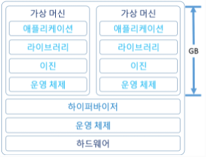
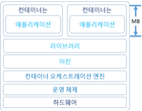

# Container
## Container 란?
```
호스트 OS 상에서 논리적인 컨테이너를 만들고, 애플리케이션을 작동시키기 위해 필요한 
라이브러리나 애플리케이션을 하나로 모아, 마치 별도의 서버인 것처럼 사용할 수 있게 만든것이다.

호스트 OS의 리소스를 논리적으로 분리시키고, 여러 개의 컨테이너가 공유하여 사용한다.
컨테이너는 오버헤드가 적기 때문에 가볍고 고속으로 작동하는 것이 특징이다.

컨테이너는 가상 머신과 마찬가지로 어플리케이션을 관련 라이브러리 및 종속항목과 함께 패키지로 묶어 소프트웨어 서비스 구동을 위한 격리 환경을 마련해 준다.

컨테이너를 사용하면 개발자와 IT운영팀이 훨씬 작은 단위로 업무를 수행할 수 있으므로 그에 따른 이점이 많다.
```

## Container를 사용해야 하는 이유
```
개발을 하기위해 하나의 환경을 구축하기 위해선 꽤 많은 수고가 들어간다.
먼저 서버가 있어야 되고, OS를 구축해야하고, 개발을 위한 네트워크 통신 포트 구성과 개발 툴들의 설치 등등.. 많은 설정이 필요하다.

그럼 이런 환경을 각 서버나 개발자의 PC 별로 일일히 설치하기엔 반복적인 일들을 여러번 해야하고
또 환경 구성이 잘못되거나 에러가 발생하면 다시 처음부터 구성을 해야하는 등의 불편함이 존재한다.

이런 반복적이고 불편한 세팅을 한번 해놓고 그 설정을 베포하는 방식을 생각하여 나온게 Container 이다.
```

## VM vs Container
```
가상머신과 컨테이너는 둘 다 소프트웨어 가상화 기술을 사용하여 애플리케이션을 격리하고 실행하는데 사용한다는 공통점이 있지만 큰 차이점이 있다.

이 둘의 가장 큰 차이점은 OS 가상화이다. 


가상머신을 사용하려면 처음에 OS를 설치해야 한다.
윈도우면 windows 전용 iso 파일을 다운받아야 하고, 별도로 메모리, 하드 용량을 설정한 다음에 OS설치를 진행하고,
리눅스면 ubuntu같은 iso를 다운받고 일일히 실제 PC처럼 별도로 세팅을 해줘야 한다.

그 이유는 호스트 OS와 다르게 독립적으로 OS를 구축해서 동작하기 때문이다.
그래서 별도의 환경을 구성해서 만든거라 구동하는데 좀 시간이 걸린다.

노트북으로 가상머신을 사용하는경우 메모리를 많이 잡아먹어서 PC가 멈추거나 가상머신의 OS가 작동하지 않는 경우도 있다.


반대로 컨테이너는 이런 부분에서 더 낫다고 볼 수 있다.
컨테이너는 경량화에 초점을 두고 있어서 최소 메모리만 사용하도록 구성되어 있다.
그래서 실행 속도도 빠르고 , 메모리를 최소한으로 잡아먹는다.
또, 가상머신은 설치 OS별로 별도의 공간을 구상해줘야 하는데 컨테이너는 그럴 필요가 없다.

그 이유는 컨테이너의 OS 가상화라는 개념이 존재하기 때문이다.
OS 가상화는 사용하려는 OS를 호스트 OS와 독립하는 방식이 아닌, 커널만 공유하여 '프로세스'로 실행하는 개념이다.
그래서 별도의 공간이나 메모리 등을 설정해야하는 가상머신보다 호스트에게 부담도 적고, 실행 속도도 빠르다는 장점이 있다.

위 같이 가상화 수준이 가장 큰 차이점이고 아래와 같은 차이점들도 있다.
```
- 자원사용:
    - VM

        

        ```
        가상머신은 일반적으로 크기가 GB 단위이다. 

        가상머신은 자체 OS를 포함하고 있어 리소스 집약적인 기능 여러 개를 동시에 수행 할 수 있다. 
        가상머신에서 사용할 수 있는 리소스가 늘어남에 따라 전체 서버, OS, 데스크탑, 데이터베이스, 네트워크를 추상화, 분할, 복제, 에뮬레이션 할 수 있다.

        하지만 위에서 말했듯이 하이퍼 바이저 위에 Guest OS가 올라가는데 그 위에 Binary, 라이브러리 등을 모두 구성해야 하기 때문에 무겁고 성능 저하가 발생한다.

        이 문제를 오버헤드라고 한다.
        ```
    - Container

        

        ```
        컨테이너는 일반적으로 크기가 MB 단위이다. 

        앱보다 크거나 실행하는데 필수적인 요소는 아니며, 특정 작업을 수행하는 
        단일 기능(마이크로서비스)이 컨테이너에 패키징되는 경우가 많다.

        경량화 속성과 공유 운영 체제로 인해 여러 환경 간에 매우 쉽게 이동한다.
        ```
- 시작 기간
    - VM
        - Guest OS를 부팅해야 하기 때문에 부팅 시간이 길다 (분)
    -Container
        - Host OS의 커널을 공유하므로 부팅 시간이 짧다 (초)
- Guest OS
    - VM
        - Windows/Linux 등 다양한 선택 가능
    - Container
        - 호스트 OS와 동일한 OS

## Container 장단점

### 장점
1. 가벼움
    ```
    서버에서 가상 머신보다 공간을 더 적게 차지하며, 시작하는데 일반적으로 몇 초밖에 걸리지 않는다.
    ```
2. 탄력성
    ```
    컨테이너는 서버의 리소스를 더 효율적이고 동적으로 사용한다.

    컨테이너 하나에 대한 수요가 감소하면 여분의 리소스를 다른 컨테이너에서 사용할 수 있다.
    ```
3. 밀도
    ```
    밀도란 물리적 서버 한 대에서 동시에 실행할 수 있는 개체 수를 의미한다.

    컨테이너화를 사용하면 호스트 서버의 리소스를 완전히 이용하지만 과다하게 이용하지
    않는 밀집된 환경을 조성할 수 있다.

    컨테이너는 전용 운영체제를 호스트할 필요가 없으므로 가상화와 비교하여 보다 밀집한 환경이 가능하다. 
    ```
4. 성능
    ```
    리소스 압박이 큰 경우 애플리케이션 성능은 하이퍼바이저를 사용하는 것보다 컨테이너가 훨씬 우수하다.
    
    가상머신에서는 게스트 OS도 자체 메모리 요구 사항을 충족해야 하기에 RAM을 호스트에서 가져와야한다.
    ```
### 단점
```
보안 이슈가 있다.

컨테이너는 커널을 공유한다. 
즉, 논리적으로 격리한 개념인데 당연히 물리적으로 격리한 가상머신에 비해서는 보안이 취약할 수 밖에 없다.

그리고 컨테이너는 MSA (Microservice Architecture) 와 최적화 되었을때 빛을 본다.
```