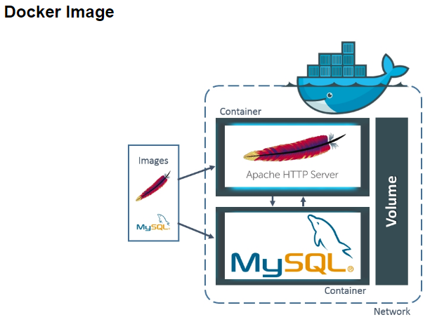
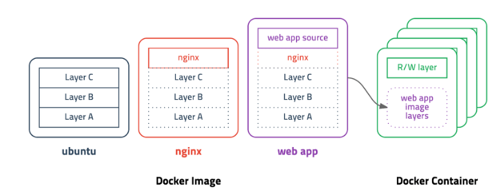
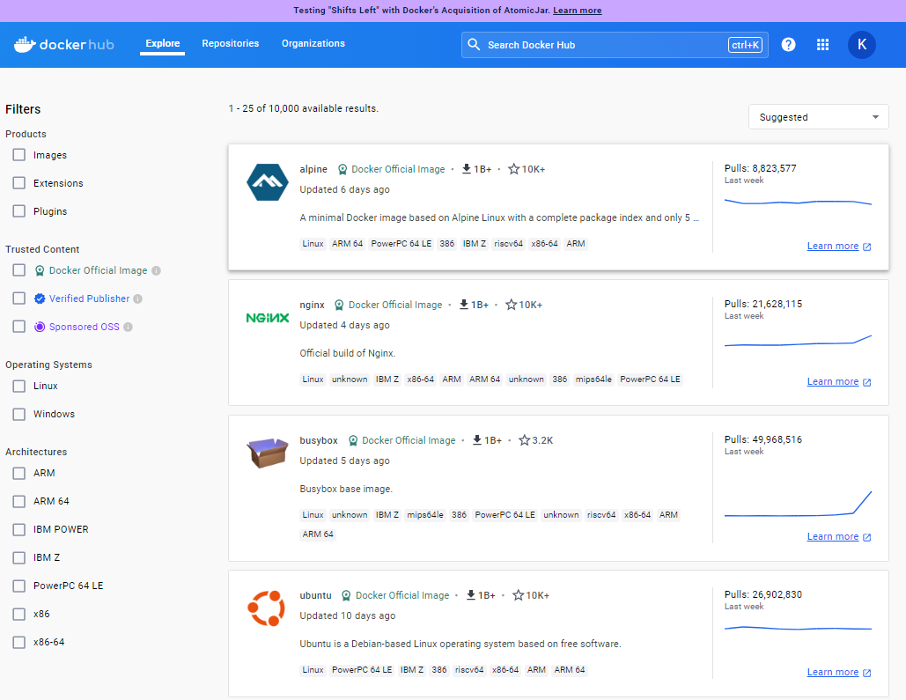
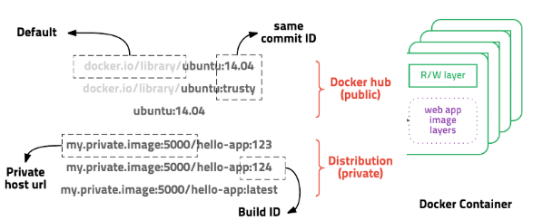
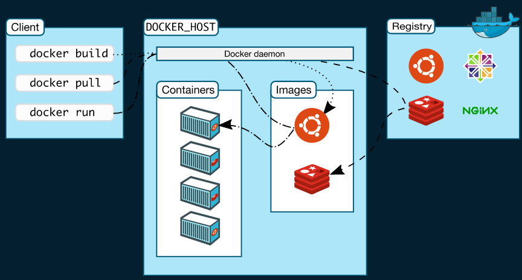

# Docker

## Docker 란
```
컨테이너화 기술을 제공하는 소프트웨어 플랫폼이다.

소프트웨어를 표준화된 단일 유닛인 컨테이너로 패키징하고 배포하는 데 사용된다.
도커는 애플리케이션을 샐행하는 데 필요한 모든 것을 포함하며, 환경에 관계없이 일관된 실행 환경을 제공한다.
이를 통해 개발, 테스트 및 배포 프로세스를 효율적으로 관리할 수 있다.
```

## Docker 구성
### Docker Image


```
Docker Image란 컨테이너를 실행할 수 있는 실행파일, 설정 값 들을 가지고 있는 것이라고 생각하면 된다.

그림처럼 Image를 컨테이너에 담고 실행을 시킨다면 해당 프로세스가 동작하게 되는 것이다.

그럼 이미지는 어떻게 만들어질까? (Ubuntu Linux를 예시로 들겠다.)
```


1. Ubuntu 이미지를 만들기 위해 Layer A, B, C가 들어간다 (각 Layer은 Ubuntu를 구성하는 구성파일이다.)
2. Ubuntu 이미지를 사용하여 Nginx Layer을 추가 함으로써 Nginx 이미지를 만든다.
3. Nginx 이미지에 Web app Source Layer을 추가하여 Web app 이미지가 만들어진다.
4. 이렇게 만들어진 Web app Image로 Docker Container를 구축한다.

### Docker File
```
Docker Image들을 저장하고 배포하는 Docker Hub가 있다

이미 여러 회사들은 소프트웨어를 Docker Hub를 통해 배포하기 시작했고 Docker hub에서 image를 pull하여 간단하게 컨테이너에 넣어 사용할 수 있다. 
하지만 배포판이 없거나, 배포판 보다 더욱 보안하고 싶을때 사용할 수 있는게 Docker File이다.

Docker File은 이미지 생성 출발점으로 이미지를 구성하기 위한 명령어들을 작성하여 이미지를 구성할 수 있다.
그 뜻은 Docker File을 읽을 수만 있다면 해당 이미지가 어떻게 구성되어 있는지도 알 수 있다는 의미가 된다.
```
```
FROM jdk8:latest
    
WORKDIR /app

RUN mkdir /app/nexus-2.14.9-01
RUN mkdir /app/sonatype-work
RUN yum -y install httpd

ENV JAVA_HOME /usr/local/jdk1.8.0_181
ENV PATH=$JAVA_HOME/bin:$PATH
ENV CLASSPATH=.

EXPOSE 3411 
ADD run.sh /app/
           
CMD ["/app/run.sh"]
```
```
Docker File은 다음과 같이 작성된다.
많은 명령어가 있고 이미지 생성에 있어 다양한 설정을 줄 수도 있다.
```

### Docker Hub & Docker Registry
Docker Hub



```
Docker Hub는 도커 컨테이너 이미지의 원격 저장소이다.

도커 컨테이너 이미지를 빌드, 저장 및 공유할 수 있는 중앙 리포지토리를 사용한다.
사용자들은 Docker Hub를 통해 컨테이너 이미지를 검색하고, 다운로드하며, 업로드하여 다른 사용자와 공유할 수 있다.

Docker Hub에는 공식적으로 유지되고 업데이트되는 수많은 오픈 소스 컨테이너 이미지들이 있어서,
이 이미지들을 사용함으로써 개발자들은 높은 품질의 이미지들을 손쉽게 활용할 수 있다.
(GitHub와 동일하게 생각해도 무방하다)
```
Docker Registry
```
Docker Registry도 도커 컨테이너 이미지의 원격 저장소이다.

시스템간에 컨테이너 이미지를 공유하는 중개자 역할을 하여 개발자가 클라우드 네이티브 
애플리케이션을 생성하고 제공하는 데 드는 귀중한 시간을 절약해준다.

사용자가 도커를 활용하여 이미지를 만들어 낸 것이 로컬에 저장하기에는 너무 양이 많고, 
관리하기가 어려울 경우, 원격 저장소에 이미지를 저장하였다가, 나중에 필요하게 될 경우
레지스트리에서 꺼내와서 사용하는 개념이다.

즉 사용자 이미지를 올리고 받기 위한 개인 저장소 서버 정도로 볼 수 있다.
```


```
다음은 Docker Image를 pull받기 위한 url이다.

그림과 같이 앞에있는 url을 적지 않으면 Default로 Docker Hub에서 Image를 pull 받게되고 url을 적어준다면 사설 저장소에서 이미지를 받을 수 있다.
```
### Docker Architecture(도커의 구조)

```
도커는 기본적으로 Client - Server로 나누어져 있다.

클라이언트에서 Docker Command를 사용하면 도커 서버는 REST API형식으로 명령을 전달받아 수행하게 된다.
이 때문에 원격으로 도커 서버에 명령을 전달하거나 여러 개의 도커 서버에 접근 할 수 있으며 하나의 서버 또한 여러개의 클라이언트에서 명령을 받을 수 있다.
```


```
Docker Daemon(Dockerd)
    도커 데몬은 클라이언트의 명령을 REST API로 받아 컨테이너, 이미지 네트워크 그리고 볼륨을 관리한다
    (여기서 볼륨은 컨테이너에서 생성된 데이터들을 의미한다.)

Docker Client
    위에서 언급했듯 Dockerd에 명령을 전달하기 위한 수단이다.
    Docker 명령어를 사용하면 Docker API가 REST API형식으로 Dockerd의 소켓에 전달된다.
```
