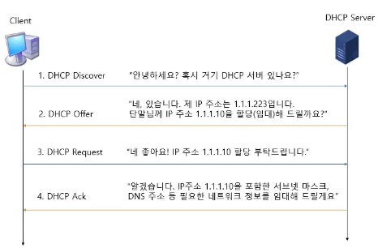

# Basic_DHCP

## DHCP (Dynamic Host Configuration Protocol)
```
DHCP란 호스트의 IP 주소와 각종 TCP/IP 프로토콜의 기본 설정을 클라이언트에게 자동적으로 제공해주는 프로토콜을 말한다.

포트번호 67번을 사용한다. 

DHCP는 네트워크에 사용되는 IP주소를 DHCP서버가 중앙집중식으로 관리하는 클라이언트/서버 모델

네트워크 안에 컴퓨터에 자동으로 네임 서버 주소, IP 주소, 게이트웨이 주소를 할당해주는 것을 의미하고, 해당 클라이언트에게 일정 기간 임대를 하는 동적 주소 할당 프로토콜이다.

DHCP 클라이언트가 IP 주소를 요청하는 주기는 다음 4가지가 같은 상황에서 발생한다.

1. 초기 부팅 
    컴퓨터나 장치가 처음으로 네트워크에 연결될 때

2. IP 주소 임대 시간 만료
    IP 주소를 할당받을 때, 해당 IP 주소에 대한 임대 시간이 설정된다. 
    이 임대 시간이 만료되면 클라이언트는 갱신하기 위해 DHCP 서버에 요청을 다시 보낸다.

3. 네트워크 변경
    클라이언트가 다른 네트워크로 이동하거나 네트워크 구성이 변경될때

4. 사용자 요청
    사용자가 수동으로 DHCP 클라이언트를 갱신하거나 IP 주소를 요청할 때
        ex) ipconfig /renew
```

## DHCP 의 장단점
### 장점
```
신뢰성 높은 DHCP IP 주소 구성
    - IP 자동 할당으로 인해 IP 충돌 방지

높은 이동성
    - 사용자는 네트워크 범위 내에서 어디서든지 모바일 장치 이용 가능

효율적인 네트워크 관리
    - 별도의 IP 할당 서버가 필요하지 않음

IP 체계의 유연성
    - PC의 수가 많거나 PC 자체 변동사항이 많아도 IP 설정이 자동으로 되기 때문에 
    효율적인 사용 가능
    - 최종 사용자에게 지장을 주지 않으면서 IP 주소 체계를 쉽게 변경
```

### 단점
```
너무 높은 의존성
    - DHCP 서버에 의존하기 때문에 서버가 다운되면 IP 할당이 제대로 이루어지지 않음

보안성 취약
    - 아무런 인증을 발생하지 않기 때문에 사이버 공격에 취약
    - 승인받지 않은 클라이언트가 DHCP 서버를 가로채 리소스에 대한 접근 권한을 탈취 가능
    - 악성 클라이언트가 DHCP 리소스를 소모시킬 수 있음
```

## DHCP 프로토콜 원리
```
DHCP 서버가 IP 주소를 영구적으로 클라이언트에 할당하는 것이 아닌 임대기간(IP Lease Time)을 명시하여 해당 기간 동안만 클라이언트가 IP 주소를 사용하도록 임대해주는 것
( 임대기간은 설정에 따라 다르지만 24시간을 기본 임대기간으로 설정하는 경향이 있다 )

클라이언트가 임대기간 이후에도 해당 IP 주소 사용을 원한다면 IP 주소 임대기간 연장(IP Address Renewal)을 DHCP 서버에 요청해야 함

임대 받은 IP 주소가 더 이상 필요하지 않으면 IP 주소 반남 절차(IP Address Release) 수행
```

## DHCP 주소 할당 절차


### DHCP Discover
- 클라이언트가 DHCP 서버를 찾는 단계
- 이더넷에 DHCP 서버를 찾기 위한 Discover 메시지를 브로드캐스팅한다.
- 동일 서브넷 안의 모든 클라이언트들이 이 메시지를 수신하게 된다.

### DHCP Offer
- Discover 메시지를 수신하고 패킷을 확인한 후 Broadcast flag 를 확인하여 Offer(제안)을 broadcast로 보낼지 unicast로 보낼지 정한다. (위 사진은 broadcast로 보냄)
- 마찬가지로 동일 서브넷 안의 모든 단말들이 이 메시지를 수신한다.
- DHCP 서버의 존재와 클라이언트에 할당할 IP 주소 등 다양한 네트워크 정보를 전달
- `주요 파라미터` (일반적인 파라미터로 따로 설정하거나 바꿀 수 있음)
    ```
    1. Client MAC: 클라이언트의 MAC 주소
    2. Your IP: 클라이언트에 할당(임대)할 IP 주소
    3. Subnet MasK (Option 1): 클라이어트의 subnet mask 주소
    4. Router (Option 3): 클라이언트의 Default Gateway IP 주소
    5. DNS (Option 6): DNS 서버 IP 주소
    6. IP Lease Time(Option 51): 클라이언트가 IP 주소를 사용(임대)할 수 있는 시간(기간)
    7. DHCP Server Identifier(Option 54): DHCP Offer를 보낸 DHCP 서버의 주소
    (2개 이상의 DHCP 서버가 DHCP Offer를 보낼 수 있으므로 각 DHCP 서버는 자신의 IP 주소를 메세지에 포함)
    ```
### DHCP Request
- 클라이언트는 DHCP 서버의 존재를 알았고, DHCP 서버가 클라이언트에 제공할 네트워크 정보를 알게 됨
- 이제 클라이언트는 DHCP Request 메시지를 통해 하나의 DHCP 서버를 선택하고 해당 서버에게 클라이언트가 사용할 네트워크 정보를 요청한다
- `주요 파라미터`
    ```
    1. Client MA: 단말의 MAC 주소
    2. Requrested IP Address(Option 50): 난 이 IP 주소를 사용하겠다. 
        (DHCP Offer의 Your IP 주소가 여기 들어감)
    3. DHCP Server Identifier(Option 54): 2대 이상의 DHCP서버가 DHCP Offer를 보낸경우,
    클라이언트는 이 중에 마음에 드는 DHCP 하나를 고르게 되고, 
    그 서버의 IP 주소가 여기에 들어감
    ```

### DHCP Ack
- DHCP Offer과 마찬가지고 DHCP Request 의 Broadcast Flag 를 확인하여 응답방식을 정한다
- DHCP 절차의 마지막 메시지로, DHCP 서버가 클라이언트에게 "네트워크 정보" 를 전달해주는 메시지
- DHCP Offer의 "네트워크 정보"와 동일한 파라미터가 포함됨