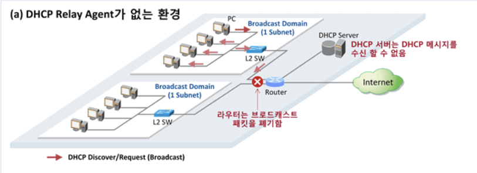
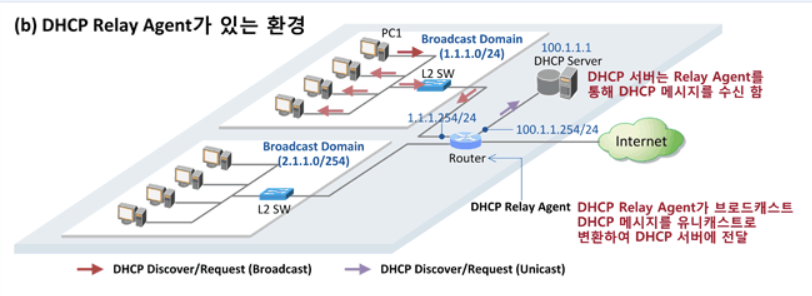

# DHCP_Relay_Agent

## DHCP Relay Agent 란
```
- Basic_DHCP 에서 설명한 내용은 같은 네트워크 상에 있는 DHCP 서버와 클라이언트가 통신하는 과정에 대해 설명하였지만 이 MD에서는 DHCP 서버와 클라이언트가 다른 네트워크 상에서 중계(relay) 서버를 통해 통신하는 과정에 대해 설명할 예정입니다

- DHCP 서버가 없는 서브넷으로부터 다른 서브넷에 존재하는 1개 이상의 DHCP 서버에게 DHCP 또는 BOOTP 요청을 중계(Relay) 해줌

- 다만, DHCP 릴레이 기능은, 제품 마다 설정, 동작 방식 등이 달라 취급이 까다로움
```
## DHCP Relay Agent 가 필요한 이유


```
DHCP 서버가 DHCP 클라이언트와는 다른 네트워크에 있을때 DHCP Relay Agent 가 없는 상황, 여러 네트워크를 하나의 DHCP 서버에서 IP 를 할당받게 하는 상황이다
(DHCP 서버의 불필요한 수를 줄여 비용을 줄이고 하나의 DCHP 서버만 관리하면 되기 때문에 오류 해결에 용이)

클라이언트는 DHCP Discover(탐색)을 브로드캐스트로 보내어 DHCP 서버를 찾으려고 하지만 같은 네트워크에는 DHCP 서버가 없기 떄문에 찾을 수 없고 DHCP 서버와 인접한 Router 까지는 브로드캐스트로 접근이 가능하지만 Router는 브로드캐스트 패킷을 폐기하기 때문에 DHCP 서버까지 도달하지 못한다
```


```
DHCP Relay Agent 를 설치한 상황

DHCP Agent 를 통해 클라이언트의 요구사항을 외부 네트워크에 있는 DHCP 서버에 도달하게 도와준다

반대로 DHCP 서버가 할당시켜주는 IP를 클라이언트에게 도달하게 도와준다
```

## DHCP Relay Agent가 있는 환경에서 메시지 흐름 요약
### 자세한 내용은 Basic_DHCP 의 DHCP 서버의 IP 할당 순서를 확인하세요
```
DHCP Discover [클라이언트 -> DHCP 서버]
    클라이언트가 브로드캐스트 시지를 보내면 이를 DHCP Relay Agent가 수신하여 유니캐스트로 변환 
    (SIP=DHCP Relay Agent, DIP=DHCP Server)하여 DHCP 서버로 전달

DHCP Offer [DHCP 서버 -> 클라이언트]
    DHCP 서버가 DHCP Relay Agent로 유니캐스트(SIP=DHCP 서버, DIP=DHCP Relay Agent)로 보내면 
    이를 수신한 DHCP Relay Agent는 단말로 브로드캐스트로 변환하여 전송

DHCP Request [클라이언트 -> DHCP 서버]
    클라이언트가 브로드캐스트 메시지를 보내면 이를 DHCP Relay Agent가 수신하여 유니캐스트로 변환
    (SIP=DHCP Relay Agent, DIP=DHCP Server)하여 DHCP 서버로 전달

DHCP Ack [DHCP 서버 -> 클라이언트]
    DHCP 서버가 DHCP Relay Agent로 유니캐스트(SIP=DHCP 서버, DIP=DHCP Relay Agent)로 보내면 
    이를 수신한 DHCP Relay Agent는 단말로 브로드캐스트로 변환하여 전송
```