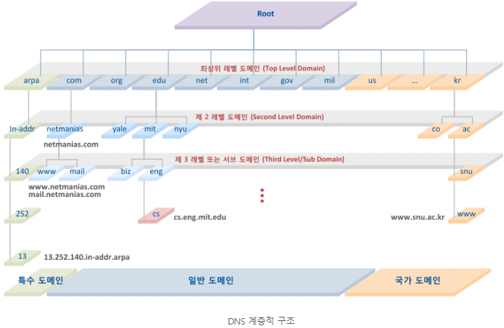
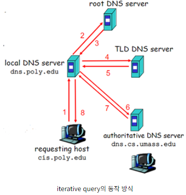
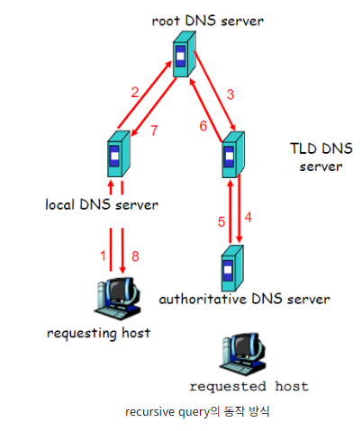

# Basic_DNS

## DNS (Doamin Name System)
```
DNS 는 사용자가 이해하기 쉬운 도메인 이름을 컴퓨터가 이해하는 숫자로 된 IP 주소로 변환한다.

예를 들면 도메인 주소가 없을때 네이버 홈페이지에 들어가고 싶으면 검색창에 http://223.130.200.104를 쳐야 하고 구글 홈페이지에 들어가고 싶으면 http://142.250.206.206 을 쳐야 한다.

우리가 원하는 사이트를 들어가고 싶을때마다 IP를 외워서 들어가는건 귀찮을 수 밖에 없다. 그렇기에 http://naver.com, http://google.com 과 같은 도메인으로 사용자가 친숙한 단어를 활용하여 접속할 수 있도록 도와주는 시스템이 DNS 이다.
(naver.com과 google.com 의 주소는 nslookup 을 통해 알 수 있다.)
```

## DNS 구성 요소

### 1\) 도메인 네임 스페이스 (Domain Name Space)


- DNS가 저장,관리하는 계층적 구조를 의미한다.
- 최상위 루트 DNS 서버가 존재하고, 그 하위 인터넷에 연결된 모든 노드(네모 표시)가 연속해서 이어진계층 구조로 구성되어 있다.
- 각 레벨의 도메인은 그 하위 도메인에 관한 정보를 관리하는 구조(계층적 구조)이다.
- 저 구조에 맞는 DNS 서비스 유형으로 iterative 방식과 recursive 방식이 있지만 뒷부분에서 다시 설명합니다.

### 2\) 네임 서버 (Name Server)
```
문자열로 표현된 도메인 이름을 실제 컴퓨터가 통신할 때 사용하는 IP 주소로 변환시켜 주기 위해서는 도메인 네임 스페이스의 트리 구조에 대한 정보가 필요하며, 이러한 정보를 가지고 있는 서버를 네임 서버라고 한다.

도메인 이름을 IP 주소로 변환하는 것을 네임 서비스 라고 한다.

리졸버(Resolver)로부터 요청 받은 도메인 이름에 대한 IP 정보를 다시 리졸버로 전달해 주는 역할을 수행한다.
```

- Master Name Server (Primary Name Server)
    - 해당 도메인을 관리하는 주 네임 서버
    - Zone 파일을 관리하는 네임서버

- Slave Name Server (Secondary Name Server)
    - Master 네임 서버의 고장 등의 이유로 동작하지 못하는 경우 이를 대신하여 네임 서버 역할을 수행하는 서버
    - 주기적으로 master 네임 서버로부터 Zone Transfer를 통해 자신의 정보를 갱신하여 일관성 있게 유지 및 관리

### 3\) 리졸버 (Resolver)
```
웹 브라우저와 같은 DNS 클라이언트의 요청을 네임 서버로 전달하고 네임 서버로부터 정보(도메인 이름과 IP 주소)를 받아 클라이언트에게 제공하는 기능을 수행

하나의 네임 서버에게 DNS 요청을 전달하고 해당 서버에 정보가 없으면 다른 네임 서버에게 요청을 보내 정보를 받아옴
```
### 스터브 리졸버 (Stub Resolver)
```
리졸버의 모든 기능을 PC와 같은 클라이언트 호스트에 구현하는 것은 단말 시스템 자원의 한계와 같은 제약이 있다.

리졸버의 대부분의 기능을 DNS 서버에 구현하고, 클라이언트 호스트에는 리졸버의 단순한 기능만을 지닌 리졸버 루틴을 구현한 것이다.

스터브 리졸버는 수 많은 네임 서버의 구조를 파악할 필요 없이 리졸버가 구현된 네임 서버의 IP 주소만 파악하면 된다.

도메인에 대한 질의를 받은 스터브 리졸버는 설정된 네임 서버로 DNS 질의를 전달하고 네임 서버로부터 최종 결과를 응답 받아 웹 브라우저로 전달하는 인터페이스 기능만을 수행한다.
```

## DNS 동작 방식

### Iterative Query


1. Host 의 hosts 파일 확인
    - hosts의 파일에서 보낼 쿼리에 대한 데이터가 구성 되어있을 수 있기 때문에 확인한다
    - Linux는 /etc/hosts 파일에 구성 되어있다
2. Local Host 의 Cache 확인
    - 한번 쿼리를 한 내용이면 Cache에 저장되기 때문에 확인을 한다
    - Windows 는 C:\windows\system32\drivers\etc\hosts 파일에 구성 되어있다
3. Host 요청
    - 사용자가 웹 브라우저에서 도메인 이름을 입력하면, Host 의 DNS 리졸버가 해당 도메인에 대한 IP 주소 정보를 요청 한다
4. `Local DNS Server` 에서 `Root DNS Server` 로 요청
    - `Local DNS Server` 에서 도메인 이름을 해석하려고 한다
    - 처음엔 캐시에서 정보를 검색하며, 이전에 해결한 도메인에 대한 정보가 있는지 확인한다
    - 캐시에 정보가 만료되거나 없을경우, Local DNS 리졸버가 `Root DNS Server`에 질의를 보낸다
5. `Root DNS Server` 응답
    - `Root DNS Server`는 도메인 이름의 최상위 도메인에 대한 정보를 반환한다
    - 이 정보는 TLD DNS 서버의 주소이다
7. `Local DNS Server` 에서 `TLD DNS Server` 로 요청
    - `Root DNS Server` 로부터 받은 정보로 해당 도메인의 `TLD DNS Server`에 질의를 보낸다
8. `TLD DNS Server` 응답
    - 요청받은 도메인의 `Authoritative DNS Server` 에 대한 정보를 `Local DNS Server` 로 반환
9. `Local DNS Server`의 응답
    - Local DNS 리졸버는 도메인 이름에 대한 IP 주소 정보를 받는다.
    - HOST의 로컬 캐시에 이 정보를 저장
10. Host 응용 프로그램 응답
    - 로컬 DNS 리졸버는 도메인 이름에 대한 IP 주소 정보를 클라이언트의 웹 브라우저나 다른 응용 프로그램에 반환하여 원하는 웹 페이지 또는 리소스를 가져오게 한다.
- 위 처럼 요청과 응답을 반복하여 쿼리를 해결하는게 Iterative 방식이다.
---
### Recursive Query


1. 1~3번 까지는 유사하다
2. `Local DNS Server` 에서 `Root DNS Server` 로 질의
    - `Local DNS Server` 는 자신의 서버에 등록되어있는지와 캐시를 확인 후 존재 하지 않으면 Root DNS Server 로 질의한다
3. `Root DNS Server` 에서 `TLD DNS Server` 로 질의
    - 질의를 받게 되면 `Root DNS Server` 는 자신의 Server에 등록되어 있는지 검색한다
    - 존재하지 않으면 `Local DNS Server` 에 응답하지 않고 다음 `TLD DNS Server` 에 질의한다
4. `TLD DNS Server` 에서 `Authoritative DNS Server` 로 질의한다
    - 질의를 받게 되면 `TLD DNS Server` 는 자신의 Server에 등록되어 있는지 검색한다
    - 존재하지 않으면 응답하지 않고 맞는 `Authoritative DNS Server` 로 질의한다
5. 9~10 번과 유사하다
- 위 처럼 Host가 질의를 한 번 보내고, DNS 서버가 필요한 정보를 찾아 반환합니다. 요청에 대한 응답을 바로 하지 않고 DNS 서버에 필요한 정보를 찾게되면 반환하여 쿼리를 해결하는게 Recursive 방식이다

## 방식에 따른 장단점

### Iterative
#### 장점
```
빠른 응답
    Host가 질의를 여러 단계로 나누어 진행하기 때문에 중간 단계의 DNS 서버에서 즉각적인 응답을 얻을 수 있다
    이로 인해 전체 질의가 빠르게 처리될 수 있다

네트워크 부하 감소
    Host가 중간 단계의 DNS 서버에 질의를 보내면 로컬 DNS 리졸버가 중간 단계에서 필요한 정보를 얻을 떄까지 대기 하지 않아도 된다
    이로 인해 네트워크 부하가 분산되며, 대규모 네트워크에서 유용하다
```
#### 단점
```
복잡성
    Host는 여러 단계의 질의를 수행해야 하므로 복잡성이 증가할 수 있다
```

### Recursive
#### 장점
```
단순성
    Host가 단일 질의를 보내기만 하면 되기 때문에 상대적으로 단순하다
```

#### 단점
```
응답 지연
    DNS 서버가 모든 질의를 처리해야 하므로 응답 지연이 발생할 수 있다

네트워크 부하 집중
    중간 DNS 서버가 모든 질의를 처리하기 때문에 이 서버가 네트워크 부하 집중지가 될 가능성이 높다
```