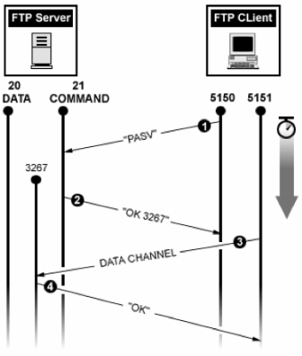

# FTP

## FTP (File Transfer Protocol)
```
기본적으로 '프로토콜'은 전자기기 간에 데이터를 교환하기 위한 통신 규약을 의미하는 반면
FTP는 TCP/IP 네트워크(인터넷)상의 장치가 파일을 전송할 때 사용하는 규약이다
```

## FTP 원리
### 간단한 이해
```
FTP로 파일을 주고 받기 위해서는 FTP서버와 클라이언트가 필요하다.

FTP 서버는 주소를 가진 집이라고 하고 클라이언트는 주소를 보고 집을 방문하는 손님이라 생각 하면 편하다

집을 드나드는 손님은 파일을 들고 들어가기도 하고, 가지고 나오기도 한다. FTP 클라이언트 프로그램은 집을 드나들 수 있게 해주는 열쇠같은 역할을 한다
```
### 원리
```
연결 설정을 위해서는 2개의 기본 채널이 필요하다. 
하나는 명령을 내리고 어떤 파일에 엑세스할 수 있는지 등의 기본 정보를 전달하는 명령 채널,
다른 하나는 2개의 장치 간에 파일 데이터를 전송하는 데이터 채널,
연결을 설정하려면 사용자는 FTP 서버로의 로그인 정보를 제공해야 하며 일반적으로는 21번 포트를 기본 통신 모드로 사용한다 


- FTP는 다른 프로토콜과는 다르게 포트(Port) 번호를 기본 2개를 사용하도록 제작되었다.
1. 제어 포트
    포트번호 21번으로 클라이언트와 서버 사이의 명령, 제어, 송수신을 담당한다.

2. 데이터 포트
    포트번호 20번으로 클라이언트와 서버 사이의 직접적인 파일 송수신을 담당한다.


- FTP 모드도 2개가 존재한다. 기본 설정으로는 Active mode 로 설정되어 있다.
1. Active mode
    클라이언트가 서버에게 연결할 데이터 포트를 알려주는 모드

2. Passive mode
    서버가 클라이언트에게 연결할 데이터 포트를 알려주는 모드
```
### Active Mode (능동 연결)


1. FTP 클라이언트에서 FTP 서버의 21번 포트에 접속한다. 명령을 송수신 하기 위해 제어 채널을 생성하고 자기 Date Port 번호를 알려준다. (1024 이상의 포트)
2. FTP 서버는 이에 대해 Ack로 응답한다.
3. FTP 서버는 20번 포트로 클라이언트의 Data Port 번호로 접속한 후 데이터 채널을 생성한다.
4. 마지막으로 클라이언트가 Ack 로 응답한다.
#### `위처럼 클라이언트가 서버에게 연결할 데이터 포트를 알려주는 모드는 Active Mode`
### Passive Mode (수동 연결)


1. FTP 클라이언트에서 FTP 서버의 21번 포트로 접속한다. 명령을 송수신 하기 위해 제어 채널을 생성한다. 클라이언트는 Passive Mode 로 연결하기 위해 PASV명령어를 전송한다.
2. FTP 서버에서는 서버가 사용할 Data Port 를 알려준다 (1024 이상의 포트)
3. 클라이언트는 서버가 알려준 포트번호로 접속을 시도하여 데이터 채널을 생성한다.
4. 서버는 Ack로 응답한 후 데이터를 송신한 후 데이터 채널 연결을 종료한다.
```
2번째 Data 포트로서 Active 모드가 사용했던 20번을 사용하지 않고 대신 1024 이후의 임의의 Dynamic Port를 사용한다. 서버에서 포트번호를 알려주기 때문에, 해당 대역의 방화벽 포트를 열어 두어야 한다
```
#### `위처럼 서버가 클라이언트에게 연결할 데이터 포트를 알려주는 Passive Mode`

## FTP의 장단점
### 장점
```
FTP는 오래된 프로토콜이기 때문에 나와있는 내용이 많아 간편하게 사용할 수 있다.

또한, 여러 개의 파일을 동시에 전송할 수 있고, 연결이 끊긴 경우 전송을 다시 시작할 수 있으며, 전송 일정을 예약할 수 있다.
```

### 단점
```
치명적 단점은 보안이 약하다는 점이다.

FTP는 오늘날 우리가 사용하는 대부분의 사이버 보안 조치가 개발된 시기보다 앞선 1970년에 개발되었다. 보안 프로토콜로 설계된 것이 아니기 때문에 FTP 전송은 파일을 암호화하지 않는다.

그래서 데이터 패킷을 캡쳐하려는 해커들이 패킷 캡처 공격을 통해 비교적 쉽게 비밀번호, 사용자 이름, 그 외 기타 민감한 데이터를 읽을 수 있다.

대신 SFTP, FTPS 처럼 FTP를 대처할 수 있는 옵션도 시장에 다양하게 출시 되었다.
```

## FTP의 대안
### SFTP 란? 
```
SFTP(SSH File Transfer Protocol)란 시큐어 셸(SSH) 데이터 스트림을 통해 보안 등급이 높은 파일 전송을 실현하는 별도의 프로토콜을 말한다. 

21번 포트를 사용하는 FTP 클라이언트와는 달리 SFTP는 SSH의 포트번호인 22번 포트를 사용한다. 

FTP의 취약한 보안으로 인해 대부분 보안 기능을 기본으로 제공하는 SSH 연결을 사용하는 SFTP를 선호한다.
```

### FTPS 란?
```
FTPS(File Transfer Protocol Secure)는 일반적으로 쓰이는 파일 전송 프로토콜의 확장으로, 기존의 FTP에 전송 계층 보안(TLS)과 보안 소켓 계층 (SSL) 암호화 프로토콜에 대한 지원이 추가되었다.

TLS/SSL을 거치는 프로토콜인데 그 말은 공개키 암호화 방식을 이용하여 통신 라인을 거쳐가는 21번, 20번 포트를 안전하게 암호화한다는 말이다.

공개키 암호화 방식은 결국 서버 공개키로 암호화 하면서 서버가 가진 비공개 개인키로만 풀 수 있기 때문에, 공개키가 노출되어도 문제가 없는 암호화 방식이다


FTPS는 크게 2가지로 나눌 수 있다

1. 암시적 연결 (Implicit FTPS)
    - 주로 보안이 강화된 상태에서 연결을 시작해야 하는 경우에 적합
    - 기본적으로 FTP의 990번 포트를 사용
    - 클라이언트가 서버와 연결과 동시에 SSL/TLS 암호화가 자동으로 시작, 
    클라이언트 서버 간의 통신은 항상 보안 되어 있다.
    - 연결이 항상 암호화되어 있으므로 보안성이 높다
    - 방화벽 및 NAT 설정에서 문제가 발생할 수 있다

2. 명시적 연결 (Explicit FTPS=(FTPES))
    - 호환성이 높아야 하며, 기존의 FTP 클라이언트와의 상호 운용성이 중요한 경우에 적합
    - 기본적으로 FTP의 일반적인 포트인 21번을 사용
    - 클라이언트가 일반적인 ftp 연결을 시작하며, 클라이언트가 명령을 통해 SSL/TLS
    연결을 명시적으로 요청한다.
    - 호환성이 높고, 기존의 FTP 클라이언트에서도 사용할 수 있다
    - 일반 FTP 연결로 시작하므로 처음 몇 단계의 통신은 암호화되지 않을 수 있다
```
#### 장점
```
가장 중요한 장점은 암시적 SSL을 사용하면 보안 연결을 위해 예약된 전용 포트를 사용할 수 있다는 것이다

이 전용 포트는 항상 켜져 있고 수동 활성화가 필요하지 않기 때문에 세션을 정리할 때 오버헤드가 덜 필요 하다
    - 오버헤드 : 어떤 작업이나 프로세스를 수행하는데 필요하지만, 
    목표로 하는 작업에 직접적으로 기여하지 않는 추가적인 비용이나 부담을 말함 
```
#### 단점
```
관리자가 통신 및 무결성 보호 암호화 수준을 지정하지 것을 허용하지 않으므로 일부 전송 유형의 경우 FTPES에 비해 보안 수준이 낮아질 수 있다
```

### Dynamic Port 
- FTP에서 Passive Mode에서는 서버가 동적으로 데이터 포트를 열어서 클라이언트로부터의 데이터 전송을 기다린다
- 데이터 채널에 사용되는 포트가 동적으로 할당되며, 이를 `Dynamic Port` 라고 한다
- 클라이언트도 Active Mode에서 동적으로 포트를 받아오기 때문에 `Dynamic Port`를 사용한다
- OS 별로 Dynamic Port 범위가 다르다
```
Windows
    주로 49152에서 65535까지의 포트 범위가 동적 포트로 사용

Linux 
    주로 32768에서 60999까지의 포트 범위가 동적 포트로 사용
    (/proc/sys/net/ipv4/ip_local_port_range 파일에서 범위를 확인할 수 있다.)


PFTP 서버 소프트웨어에 따라서도 이 동작 포트 범위가 달라질 수 있다
ProFTPD나 vsftpd 같은 FTP 서버에서는 구성 파일을 통해 동적 포트 범위를 지정 할 수 있다.
```