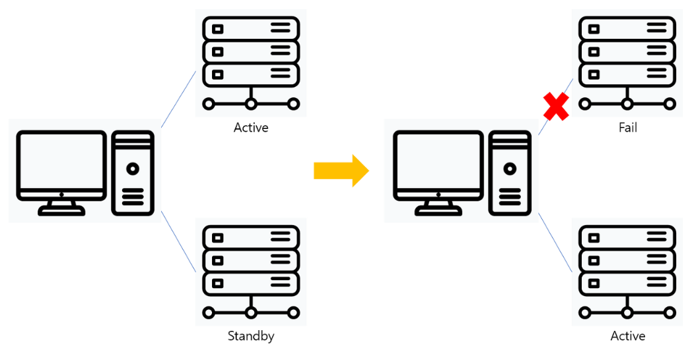

## Failover
###  Failover란 ?
```
평소 사용하는 서버와 그 서버의 클론 서버를 가지고 있다가 사용 서버가 장애로 사용이 어렵게 될 경우, 클론 서버로 그 일을 대신 처리하게 해서 무정지 시스템을 구축해 주는 것을 의미한다.

즉, Fail(실패)를 Over(끝낸다)는 의미로, 시스템 장애 시 준비되어있는 다른 시스템으로 대체되는 운영되는 것을 말한다.

기업에서는 서버가 다운되면 그 시간에 비례하여 기하급수적인 손해가 발생하므로 Failover를 반드시 해야 한다.
```

### Failover 구조


