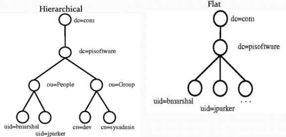
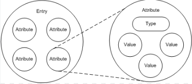

# LDAP

## LDAP(Lightweight Directory Access Protocol) 이란 ?
```
네트워크 상에서 조직이나 개인정보 혹은 파일이나 디바이스 정보 등을 찾아보는 게 가능하게 만든 소프트웨어 프로토콜

네트워크 상의 디렉토리 서비스 표준인 X.500의 DAP(Directory Access Protocol)를 기반으로한 경량화(Lightweight) 된 DAP 버전이다.
    - DAP는 OSI 전체 프로토콜 스택을 지원하며 운영에 매우 많은 컴퓨팅 자원을 필요로하는 아주 무거운 프로토콜
    - LDAP은 DAP의 복잡성을 줄이고 TCP/IP 레이어에서 더 적은 비용으로 DAP의 많은 기능적인 부분을 조작할 수 있도록 설계
```

## LDAP 구조


- LDAP 서버에는 여러 디렉토리 정보(Entry)가 계층적 트리 구조(hierarchical tree-like)로 구성되어있다.
- Entry 정보 참조는 RDN이나 DN을 사용해서 정보를 얻어올 수 있다.
- 각각의 엔트리는 다수의 속성을 갖는다.


### LDAP의 구성 요소를 4가지 모델로 나누어 설명하겠습니다.
---
### 1) Information 모델
- 데이터의 형태와 데이터를 통해 디렉토리 구조로 정보를 장하는 방식에 관한 것이다.
- LDAP 디렉토리에서 표현하는 정보 구조는 2가지 요소로 이뤄진다.
    ```
    Entry : 디렉터리에서 정보를 표현하는 기본 단위. Entry는 다수의 Attribute로 구성됨
    Attribute : Entry의 각 타입을 저장하는 공간이다.
    ```
- LDAP 디렉토리 구조는 Entry 데이터들을 트리 구조로 형성, 관리한다
    - 이러한 트리 형태의 구조를 DIT라고 함



- LDAP 디렉토리에서 데이터를 구성하는데 중요한 개념인 ObjectClass와 Schema가 있다.
    - `ObjectClass`는 Entry에서 꼭 필요하거나 가질 수 있는 Attribute 타입을 정의한다.
    - 또한 ObjectClass는 다른 ObjectClass를 상속해 구현하며 개념을 확장할 수 있다.

    - `Schema`는 ObjectClass와 Attribute에 대해 정의하는 규칙
    - ObjectClass에 어떤 Attribute가 들어갈지 정의할 수 있다.
    - Attribute의 값에 대한 제약 및 조건 등 관련된 규칙들을 정의할 수 있다.
    - Schema 정의를 통해 여러 응용 프로그램에서 디렉토리 서비스를 읽고 사용할 때 상호 운용성을 보호해주는 역할을 한다.

### 2) Naming 모델
- LDAP 디렉터리 구조에서 각 Entry를 어떻게 식별하고 구성하는지에 대해 설명
- Entry는 여러 자식 Entry들을 가지는 형태의 트리 구조로 나타나게 된다.
- 각 Entry 계층에서는 해당 계층을 나타내는 고유한 주소 Attribute를 지니는데 이를 RDN이라고 부른다.
- 경로 내 RDN값들을 이어 붙여 생성된 고유한 문자를 DN이라고 부른다.
- LDAP의 DIT 형태에서 가장 위에 존재하는 Entry는 DIT의 시작점, 데이터 트리의 루트로 보며 하나의 데이터셋으로 이해할 수 있다.

### 3) Functional 모델
- LDAP 디렉토리에서 작업하는 명령을 다룬다.
- 8가지의 작업 명령을 보통 나누게 되고 작업 명령의 기능에 따라 3가지로 구분한다.
#### 질문작업
- Search : 주어진 조건에 맞는 Entry 도출
- Compare : 특정 Entry 의 Attribute 값 비교
#### 갱신작업
- Add : 디렉토리에 신규 Entry 추가
- Delete : 디렉토리에 기존 Entry 삭제
- Modify : 디렉토리에 기존 Entry 수정 및 Entry DN 값 변경
#### 인증작업
- Bind : 디렉토리 서버 연결 시 사용자 인증
- Unbind : 디렉토리 서버와의 연결 해제
- Abandon : 이전 요청 명령을 취소

### 4) Security 모델
- 디렉토리에 접근하는 사용자 인증과 데이터 접근 권한을 통해 서비스를 보호하는 방식에 대해 설명
- SSL/TLS 인증 방식을 통해 서버-클라이언트 간 연결을 구성할 수 있다
- 데이터 전송 시 바이너리 암호화를 적용해 정보를 보호한다.


## 주요 용어
1. DN (Distinguish Name) :
    ```
    개체를 고유하게 식별하는 데 사용되는 고유한 이름
    LDAP 디렉터리 트리에서 특정 항목의 위치를 정의하며 계층적인 구조로 표현됩니다.

    LDAP에서 검색하거나 수정할 때 사용되는 주요 식별자 중 하나이며, 디렉터리에서 특정 개체를 찾거나 특정 개체에 액세스하기 위해 사용됩니다.
    ```

2. RDN (Relative Distinguish Name) :
   ```
   DN 의 상대적인 부분으로서, 특정 항목을 다른 항목과 구별하는 데 사용되는 일부이며,
   DN 의 각 구성 요소를 RDN 이라고 한다.
   특정 항목의 위치를 식별하기 위한 부분이다.
   ```

3. DIT (Directory Information Tree) :
   ```
   LDAP 디렉터리에 저장된 데이터를 트리 형태로 표현한 방법을 설명한다.

   각 항목은 다른 항목과 부모-자식 관계로 연결되어 있습니다. 
   이 트리 구조는 일반적으로 조직의 계층적 구조를 반영하며, 조직의 부서, 사용자, 장치 등을 표현하는데 사용
   ```

4. LDIF (LDAP Data Information Format) :
   ```
   LDAP 디렉터리에 저장된 데이터를 텍스트 형태로 표현한 방법을 설명한다.

   LDIF는 LDAP 디렉터리 정보를 읽거나 작성하는 데 사용되며, 일반적으로 디렉터리 서비스 간에 데이터를 교환하는 데 활용한다.
   ```

5. UID (User ID) :
   ```
   LDAP 에서 사용자를 고유하게 식별하는 데 사용하는 속성을 나타낸다.

   외부에서 읽기 쉽게 표현된 CN과는 다르게 내부적으로 사용한다.
   ```

6. DC (Domain Component) :
    ```
    LDAP 에서 사용되는 속성 중 하나

    LDAP 디렉터리에서 도메인을 정의하는 데 사용한다.

    여러 개의 DC 속성이 합쳐져서 전체 도메인이 형성된다
    
    ex) dc=example, dc=com 
    이 경우, dc=example 과 dc=com 이라는 2개의 속성이 만나 example.com 이라는 도메인이 만들어진다.
    ```

7. OU (Organization Unit) :
   ```
   LDAP 디렉터리에서 사용되는 용어이다.

   디렉터리 트리에서 조직적인 단위를 나타내며, 일반적으로 조직 내에서 서브 그룹이나 부서와 같은 하위 조직을 표현하는 데 사용된다.
   ```

## LDAP와 Active Directory 비교
```
LDAP는 네트워크의 모든 사용자 계정을 포괄하는 정보가 포함된 대규모 디렉터리 서비스 데이터 베이스인 AD 디렉터리 서비스 등에서 사용되는 핵심 프로토콜

구체적으로 LDAP는 DAP(Directory Access Protocol)의 경량 버전으로, TCP/IP에서 실행되는 디렉터리 서비스에 액세스하고 이를 관리하는 중앙 위치를 제공합니다.

LDAP의 주요 목표는 AD에서 오브젝트(즉 도메인, 사용자, 그룹 등)와 통신하고 오브젝트를 저장하여 이를 LDAP 서버에 있는 자체 디렉터리에 사용할 수 있는 형식으로 추출하는 것입니다.

AD는 전 세계 최대 도서관이고 사용자는 좀비가 언급된 제목의 책을 찾고 있다고 생각해 볼때,
LDAP의 세계에서는 이 책이 미국에서 출판되었는지, 분량이 1,000 페이지 이상인지 같은 안내는(선택 가능한 옵션을 줄이는 데는 도움이 되지만) 중요하지 않습니다.
LDAP는 요청에 맞는 옵션을 모두 찾을 수 있는 위치를 정확히 알고 원하는 것을 찾았는지 확인해주는 숙련된 사서에 해당합니다.
```