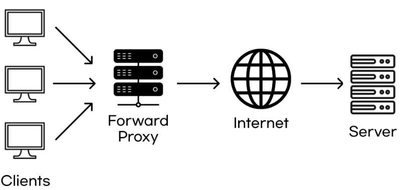
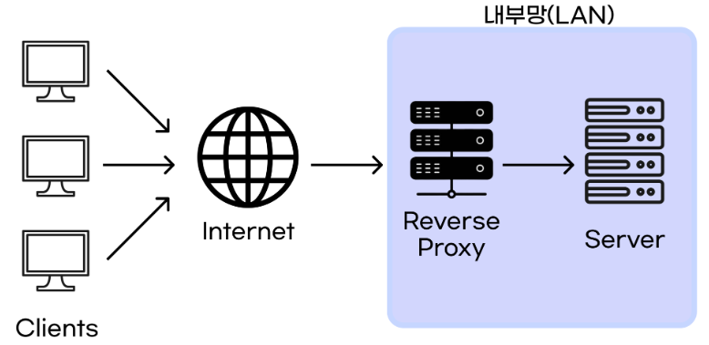

# Proxy

## Proxy 란? 
```
대리, 대신이라는 뜻을 가지고 있는 Proxy는 클라이언트와 서버 사이에 위치하고 있어, 대신 통신을 받아주고, 중계기로서 대리로 통신을 수행하는 것을 Proxy라고 한다.

내부 네트워크에서 인터넷 접속을 할 때에, 빠른 액세스나 안전한 통신등을 확보하기 위한 중계서버를 "프록시 서버"라고 한다.

프록시 서버는 클라이언트가 자신을 통해서 다른 네트워크 서비스에 간접적으로 접속할 수 있게 해주는 컴퓨터 시스템이나 응용프로그램을 가리킨다.

프록시 서버 중 일부는 프록시 서버에 요청된 내용들을 캐시를 이용하여 저장해 둔다.
이렇게 캐시를 해 두고 난 후에, 캐시 안에 있는 정보를 요구하는 요청에 대해서는 원격 서버에 접속하여 데이터를 가져올 필요가 없게 됨으로써 전송 시간을 절약할 수 있게 됨과 동시에 불필요하게 외부와의 연결을 하지 않아도 된다는 장점을 갖게 된다.
```

## Proxy Server 의 특징
```
프록시 서버는 클라이언트와 서버의 입장에서 볼 때 서로 반대의 역할을 하는 것처럼 보여지게 된다.

클라이언트가 프록시를 바라보면 프록시가 "서버"와 같이 동작을 하게 되는 것이고, 반대로
서버가 프록시를 바라보면 "클라이언트"처럼 작동을 하게 되는 것이다.
```

## Proxy 종류

### 1. 포워드 프록시 (Forward Proxy)



- 보통 말하는 프록시가 바로 이 포워드 프록시를 말한다.
- Client와 Server 사이에 위치하여 요청을 중계하며, 요청과 응답은 Proxy Server를 거친다.
- 클라이언트를 감추는 효과가 있다.

### 2. 리버스 프록시 (Reverse Proxy)



- 포워드 프록시와 마찬가지로 요청과 응답이 Proxy Server로 이동하는데, Server들이 주로 내부망으로 주성되며 프록시에게만 연결을 허용하는 차이점이 있다. 즉, 서비스를 위한 보안 채널을 구축한다.
- 이런 경우 Client가 Server에 직접 접근이 불가능하므로, Reverse Proxy에서 요청을 적극적으로 중계하는 Load Balancing의 역할을 수행하기도 한다.
- 서버를 감추는 효과가 있다.

## 프록시 서버를 사용하는 이유

### 1. 개인정보를 보호할 수 있다.
```
프록시 서버 없이 클라이언트가 서버에 요청 시 본인의 IP 주소가 노출되는데, 프록시 서버를 사용 시 서버측에서 나의 IP가 아닌 프록시 서버의 IP를 보게 된다.

즉, 클라이언트의 IP를 보호할 수 있다.
```

### 2. 캐시를 사용해서 속도가 향상된다.
```
프록시 서버는 웹페이지를 가져올 때 자신의 DB에 최근 데이터를 저장하는데, 이것을 Cache라 한다.

이렇게 될 시, 같은 요청이 들어오면 Cache자원을 반환하여 서비스의 속도를 높이고 대여폭도 줄일 수 있다.
```

### 3. 로그를 기록, 관리할 수 있다.
```
서버 측에선 클라이언트의 기록대신 프록시 서버의 기록이 있지만, 프록시 서버에겐 클라이언트의 기록이 남아있다.

이 기록들을 보면 어떤 IP에서 어떤 IP로 얼마나 접속해 있는지 확인할 수 있고, 특정 IP가 방문할 수 있는 웹사이트도 제한할 수 있어서 회사에서 많이 사용한다.
```

### 4. 접속을 우회할 수 있다.
```
특정 사이트에서 IP를 검사해 한국에서의 접속을 차단하는 경우가 있는데, 이런 경우 프록시 서버를 사용해 접속 시 다른나라에서 접속한 것처럼 우회할 수 있다.
```

## Proxy Chainning
```
클라이언트의 IP를 숨기기 위해 여러 프록시 서버를 경우하는 기술을 Proxy Chaining이라고 한다.

예를 들어 Client -> Proxy_Server1 -> Proxy_Server2 -> ... -> Server처럼 사용하는 것인데, 
이렇게 되더라도 프록시 서버를 계속하여 추적하면 클라이언트를 알아낼 수도 있지만 여러 국가에 접속하여 우회하면 알아내기 힘들다.
```

## VPN 과의 차이점
```
클라이언트와 서버 간의 통신에서 사용자의 온라인 활동을 보호하는데 사용된다는 점은 비슷하지만 다양한 차이점이 존재한다.

1. 프록시는 주로 웹 트래픽을 관리하고 필터링하는 목적으로 사용되는 반면에, VPN은 모든 인터넷 트래픽을 보호하고 암호화하여 보다 강력한 보안과 익명성을 제공한다.

2. 프록시를 사용하면 클라이언트의 실제 IP 주소를 숨길 수 있지만 트래픽은 일반적으로 암호화 하지 않는 반면에, VPN은 클라이언트의 모든 트래픽을 암호화하고, 클라이언트와 서버 간에 안전한 터널을 형성하여 실제 IP 주소를 완전히 숨깁니다.

3. 프록시는 특히 캐싱을 통해 트래픽을 최적화하고 빠른 속도를 제공할수 있는 반면에, VPN은 트래픽을 암호화하고 중계하기 때문에 일부 속도 저하가 발생할 수 있다.

요약하면, 프록시는 특히 웹 트래픽 관리와 익명성 제공에 중점을 두며, VPN은 모든 인터넷 트래픽을 보호하고 안전한 연결을 제공하는 데 중점을 둡니다.
```