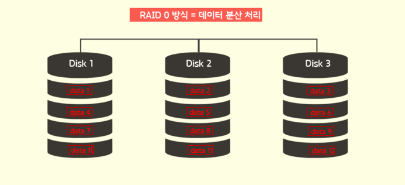
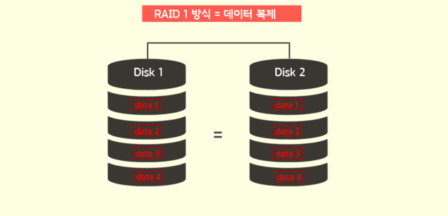
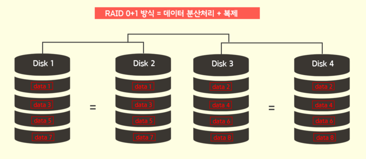
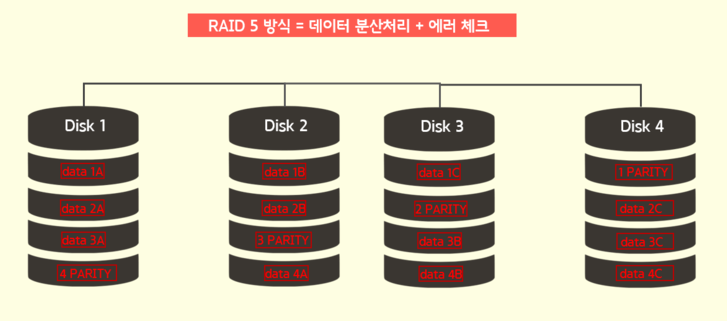
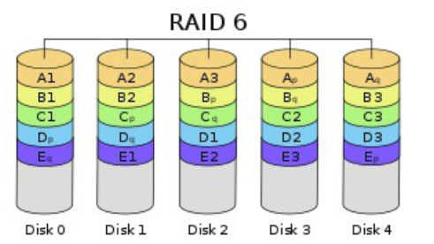

# RAID

## RAID 란 ?
```
'Redundant Array of Independent Disk' 또는 'Redundant Array of Inexpensive Disk'
의 약자로, 2개 이상의 디스크를 병렬로 처리하여 성능 및 안정성을 향상시키는 방식이다.

과거에는 주로 용량이 작은 디스크들을 연결하여 디스크 용량을 높이기 위해 사용되었는데,
요즘에는 디스크 성능 향상에서 나아가 디스크 오류나 데이터 손실 등 장애에 대비하기 위한 용도로 사용되고 있다.

종합하면 한 개의 디스크에 데이터를 저장하는 방식이 아닌, 데이터 저장의 성능 및 안정성
확보를 위해 복수의 디스크를 구성하는 방식을 레이드(RAID)라 한다.
```

## RAID 종류
```
어떠한 방식으로 레이드를 구성하느냐에 따라 레이드 방식이 구분된다.
```
### RAID 0


```
RAID 0 방식이다. 두 개 이상의 디스크에 데이터를 순차적으로 저장하는 방식

- 한 개의 디스크에 데이터를 처리하는게 아니라 복수개의 디스크에 데이터를 분산해 처리하기 때문에, 처리 속도가 향상된다는 강점을 가지고 있다.
- 하나의 디스크가 문제가 발생하면 RAID 0으로 구성된 모든 데이터가 유실된다는 단점을 가지고 있다.
- 오직 성능향상을 위한 구성방식
```

### RAID 1


```
RAID 1 방식이다. 데이터 처리 시, 동일한 디스크에 똑같이 정리하는 방식

- 데이터를 중복 기록하여 저장하기 때문에, 디스크에 장애 및 오류 발생 시, 다른 디스크를 통해 데이터를 쉽게 복구할 수 있다. ( 가용성 및 안정성이 높다는 강점 )
- 똑같은 데이터를 디스크 2개로 중복 저장하기 때문에 실질적으로 사용할 수 있는 용량이 절반으로 줄어든다는 단점을 지니고 있다. ( 1GB 디스크를 2개 쓴다고 하면 원래 2GB 용량을 사용 가능하지만 RAID 1 방식에서는 1GB 용량 밖에 사용하지 못한다. )
```

### RAID 1+0 or RAID 10


```
RAID 1+0(10) 방식이다. RAID 0 과 RAID 1의 단점을 보안하기 위해 결합한 방식

- RAID 0은 데이터 처리 성능은 향상 되지만 안전성에 취약하다는 단점, RAID 1은 데이터 복제를 통해 안정성은 높지만 성능이 취약하다는 약점을 지니고 있는데 각각의 약점을 보안하기 위해 결합한 방식이다.
- 2개 이상의 디스크를 RAID 0 방식으로 구성하여 데이터를 분산처리하고, 각각의 디스크에 RAID 1 방식으로 디스크를 추가하여 데이터를 안전하게 복제하는 방식이다.
```

### RAID 2, 3, 4
```
거의 사용하지 않는 RAID 이기 떄문에 간단하게 설명하겠습니다

RAID 2 : 
Bit 단위로 striping하고 error correction을 위해 Hamming code를 사용한다. 
(Bit 단위로 striping 하기 때문에 너무 작게 쪼개져 현재는 사용하지 않는다.)

RAID 3 : 
Byte 단위로 striping하고 error correction을 위해 패리티 디스크를 1개 사용한다. 
(RAID 2 와 유사하게 Byte 단위로 striping 하기 때문에 너무 작게 쪼개져서 사용하기 힘들고, 
패리티 정보를 디스크에 별도 보관하기 때문에 해당 디스크 손실 시 복구가 어렵다는 취약점 때문에 현재는 사용하지 않는다.)

RAID 4 : 
Block 단위로 striping을 하고, error correction을 위해 패리티 디스크를 1개 사용한다. 
(패리티를 별도 보관하기 때문에 해당 디스크 손실 시 복구가 어렵다는 취약점 때문에 현재는 사용하지 않는다.)
```

### RAID 5


```
RAID 5 방식이다. RAID 3, 4의 단점을 보안하기 위해 만들어진 방식

- 패리티 정보를 별도 디스크에 보관함으로써 생기는 약점을 보완하기 위해 나온 방식이다.
- 패리티 정보를 보관하는 디스크 구성 없이, 일정한 로직에 의해 '데이터 분산처리' + '에러 체크'를 구성하는 방식
- 성능, 안정성을 모두 고려한 형태로 서버 구축 시 많이 사용하고 있는 레이드 방식이다.
```

### RAID 6


```
RAID 6 방식이다. RAID 5에서 성능, 용량을 좀 더 줄이고, 안전성을 좀 더 높인 방식

- Block 단위로 striping을 하고, error correction을 위해 패리티를 2개의 디스크에 저장하는데, 패리티 저장 하는 디스크를 고정하지 않고, 매 번 다른 디스크에 저장한다
- RAID 5보다 안전성 면에서 개선된 방식이지만, 비용, 용량, 성능, 적용 분야에 대해서 RAID 5가 효율적이기 때문에 아직은 RAID 5 방식이 더 많이 쓰인다.
```

### 기술적 용어
```
RAID와 같은 데이터 스토리지 시스템(FS, NAS, SAN)에서 사용되는 여러 기술적 용어 들이 있습니다.
```
1. 스트라이핑(Striping)
   - 연속된 데이터를 여러 개의 디스크에 라운드로빈 방식으로 기록하는 기술이다.
   - 이 기술은 하나의 디스크에서 읽어들이는 것 보다 더 빠르게 데이터를 읽거나 쓸 수 있다면 매우 유용하다.
  
2. 미러링(Mirroring)
   - 미러링 기술은 디스크에 에러가 발생 시 데이터의 손실을 막기 위해, 추가적으로 하나 이상의 장치에 중복 저장하는 기술이다.
   - 두 개의 디스크를 구성했을 경우, 하나의 디스크에 에러가 발생해도 다른 디스크의 데이터는 그대로 보존된다.
3. 패리티(Parity)
   - 디스크 장애 시 데이터를 재 구축하는데 사용할 수 있는 사전에 계산된 값으로, 디스크의 4개의 블록 중 3개는 데이터를 저장하는데 쓰고 나머지 하나는 Parity 영역으로 두는 것이다.
   - 따라서 문제가 발생했을 경우, 컨트롤러가 정상적으로 운영되고 있는 다른 디스크로부터 손실 된 데이터를 가져와 복구/재생 합니다.
4. 스패닝(Spanning)
   - 디스크가 다 차면 다른 디스크에 이어서 데이터를 기록하는 방식이다.
   - ​이러한 특성으로 인해 분산을 통한 성능은 없으며 여러개의 디스크를 하나의 공간으로 묶는 것으로만 목적을 하고 있다.