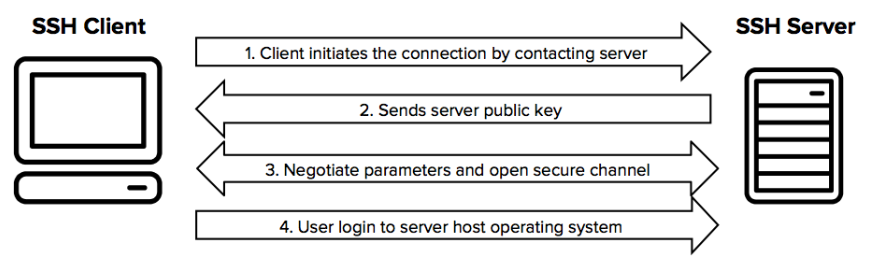

# SSH

## SSH(Secure SHell) 란 ?
```
네트워크 상 다른 컴퓨터의 쉘을 사용할 수 있게 해주는 프로그램 혹은 프로토콜을 의미한다.
뜻 그대로 보안 셸이다.

기존의 유닉스 시스템 셀에 원격 접속하기 위해 사용하던 텔넷은 암호화가 이루어지지 않아 계정 정보가 탈취될 위험이 높으므로, 여기에 암호화 기능을 추가하여 1995년에 나온 프로토콜이다.

셸로 원격 접속을 하는 것이므로 기본적으로 CLI 상에서 작업을 하게 된다. 기본 포트는 22번이다.

SSH는 강력한 보안을 제공하기에 안전하지 못한, 개방된 네트워크에서도 안전하게 통신할 수 있다.
```

## 쉘 (Shell)
```
쉘이란 사용자의 명령을 커널(Kernel)에 전달하고, 그 처리 결과를 다시 사용자에게 알려주는 프로그램을 뜻한다.

쉘은 커널을 마치 껍질처럼 감싸고 있어, 사용자는 이 껍질을 통해야만 커널과 통신할 수 있다 하여 이런 이름이 붙었다.

쉘은 사용자로부터 입력을 받아들이는 방식에 따라 크게 2가지로 나눌 수 있다.

- CLI (Command Line Interface) : csh, bash, ksh, zsh, cmd.exe 등
- GUI (Graphic User Interface) : Gnome, KDE 등

하지만 일반적으로 쉘이라 하면 CLI 환경의 쉘을 의미한다.
```

## SSH 작동 원리
```
SSH 프로토콜은 클라이언트 - 서버 모델로 동작하며 대칭키 방식, 비대칭키 방식, 해시 알고리즘을 사용하여 인증 및 암호화를 수행한다.

대칭키 방식은 클라이언트 - 서버 간 전체 연결을 암호화에 사용되며,
비대칭키 방식은 키 교환, 클라이언트 인증, 서버 인증에 사용되고,
해시 알고리즘은 패킷의 무결성을 확인하기 위해 사용된다.
```


1. 클라이언트는 서버에 원격 접속하기 위해 연결을 설정하는 프로세스를 시작한다.
    ```
    SSH 프로토콜은 기본적으로 TCP 22번 포트를 사용하여 통신한다.

    클라이언트가 서버에 원격 접속하기 위해 서버의 TCP 22번 포트로 SSH 접속 요청을 보내는 것이 SSH 연결의 첫 단계이다.

    서버는 클라이언트에게 서버가 지원하는 프로토콜의 버전을 응답으로 보내준다.
    
    클라이언트는 서버가 지원하는 프로토콜의 버전 중 자신과 일치하는 것이 있다면 연결을 지속한다. (버전 교환)
    ```

2. 서버는 자신의 공개키를 클라이언트에게 전송한다.
    ```
    서버는 클라이언트로부터 SSH 접속 요청을 받고 자신의 공개키를 클라이언트에게 전송하고 클라이언트는 서버로부터 받은 공개키를 로컬에 저장한다.

    클라이언트는 원격 접속하는 서버들의 공개키를 로컬사용자 홈 디렉터리의 .ssh 경로 내의 known_hosts 파일에 저장하고 있다.
    ```
    ```
    ※ 클라이언트 사용자의 known_hosts 경로(Default)

    <Linux> 
    일반 계정: /home/User/.ssh/known_hosts
    root 계정: /root/.ssh/known_hosts

    <Window>
    사용자: %USERNAME\.ssh\known_hosts
    ```

3. 클라이언트와 서버는 여러 parameter들을 주고 받으며 채널을 확립한다.
    - 3.1 올바른 서버인지 확인(클라이언트 관점)
        ```
        클라이언트는 SSH로 원격 접속하려고 하는 서버가 올바른 서버인지 확인할 필요하 있다.
        
        이를 위해 클라이언트는 known_hosts 파일에 서버의 공개키를 통해 정상적인 서버인지 확이하는 작업을 수행한다.

        확인 단계는 다음과 같다.
        1. 클라이언트에서 난수 생성, 난수 해시값 생성 및 저장
        2. 난수를 서버의 공개키로 암호화한 후 서버에 전송
        3. 서버에서 서버의 개인키로 데이터를 복호화하여 난수 추출
        4. 서버에서 복호화된 난수 해시값을 생성 후 클라이언트에게 전송
        5. 클라이언트에 저장된 난수 해시값과 서버에서 받은 난수 해시값을 비교
        6. 동일할 시 올바른 서버 확인
        ```
    - 3.2 암호화된 통신을 위한 세션키 생성(대칭키 생성)
        ```
        세션키는 대칭키로 전체 세션을 암호화하는데 사용되며 모든 통신을 암호화 한다.

        대칭키는 비대칭키에 비해 빠르고 컴퓨팅 파워가 더 적게 든다는 장점을 가지고 있다.
        그러나 대칭키가 유출되었을 경우 공격자가 암호화된 모든 통신을 복호화할 수 있는 치명적인 문제점을 가지고 있다.

        이를 해결하기 위해 클라이언트와 서버는 키 교환 알고리즘을 통해 안전하게 대칭키를 공유한다.

        SSH에서 사용하는 대표적인 키교환 알고리즘인 디피-헬만(Diffie-Hellman : DH) 알고리즘은 상대방의 공개키와 나의 개인키를 통해 대칭키를 얻어내는 방법이다.

        이 단계에서 클라이언트와 서버는 임시 비대칭키 방식의 키 쌍을 생성하고 공개 키를 교환한다.

        DH를 통해 클라이언트와 서버는 대칭키인 세션키를 공유하게 되고 이후 모든 통신은 세션키를 통해 암호화한다.
        ```
    - 3.3 서버에 접근할 수 있는 클라이언트인지 확인(서버 관점)
        ```
        서버 또한 자신에게 접속하려는 클라이언트가 자신에게 접근할 수 있는 권한이 있는지 확인하는 단계가 필요하다.
        
        가장 간단한 방법으로 패스워드 인증이 있다.
        서버는 단순히 로그인하려는 계정의 암호를 묻고 클라이언트가 입력한 비밀번호는 세션키를 통해 암호화되고 전송되어 외부로부터 안전하게 보호된다.

        패스워드가 암호화되지만 패스워드의 복잡성 설정의 한계가 있기 때문에 일반적으로 이 방법을 사용하지 않는 것이 좋다.
        ```

4. 클라이언트가 서버에 원격 접속을 할 수 있다.
    ```
    이제 세션키를 통해 클라이언트와 서버는 안전한 네트워크 통신을 수행할 수 있다.
    ```

## SSH Agent
- SSH 프로토콜을 사용하여 원격 시스템에 안전하게 접속하기 위한 키 관리 도구이다.
- 이 도구는 개인 키의 보안을 유지하면서 여러 원격 서버에 접속할 수 있도록 도와준다.
### SSH Agent의 주요 기능과 특징
1. 키 관리
    - SSH Agent는 여러 개인 키를 관리하고, 필요할 때마다 이 키를 사용자에게 제공합니다.
2. 비밀 키 보안
    - 사용자의 개인 키는 안전한 방식으로 SSH Agent에 저장되어 있으며, 사용자가 직접 키를 입력하지 않아도 된다
3. 키 전달
    - 사용자의 로그인 세션 동안 키를 캐싱하고, 다른 SSH 접속에도 동일한 키를 사용할 수 있도록 지원
    - 사용자가 한 번 키의 비밀번호를 입력하면, 해당 세션 동안 다시 입력하지 않아도 되게 한다.
4. Agent Forwarding 
    - 원격 서버 간에도 키를 전달할 수 있도록 하는 기능을 제공한다.
    - 이를 통해 사용자는 자신의 로컬 키를 사용하여 여러 서버에 접속할 수 있다.

## SSH Agent Forwarding
-  SSH 프로토콜을 사용하여 원격 시스템 간에 사용자의 인증 정보를 안전하게 전송하는 메커니즘 중 하나
-  SSH 세션을 통해 원격 호스트로 사용자의 인증 키를 전달하고, 해당 키를 사용하여 다른 호스트에 대한 접근 권한을 부여
-  원격 호스트에 로그인한 후에도 로컬 시스템의 인증 키를 사용하여 다른 시스템에 대한 접근 권한을 얻을 수 있다.