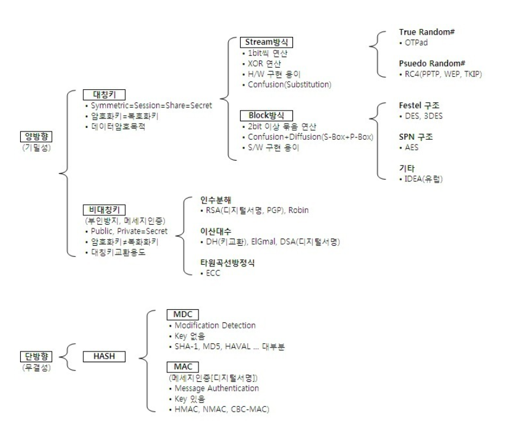

# Encryption

## 암호화란?


```
데이터 암호화는 데이터를 암호화 되지 않은 일반 텍스트(평문=>Plaintext)에서 암호화된 암호 텍스트(암호문=>Cipertext)로 변화하는 방법이다.

사용자는 암호화 키를 사용하여 암호화된 데이터에 액세스하고, 암호 해독 키를 사용하여 해독된 데이터에 액세스할 수 있다.

모르는 누군가가 해당 정보를 가로채도라도 이를 해독하지 못하게 보호하는 데 사용된다.
암호화는 주로 기밀성을 유지하고 데이터의 무결성을 보장하기 위해 적용된다.
다양한 정보, 통신 및 데이터 보호의 목적으로 암호화가 활용된다.

    기밀성 : 정보에 대한 접근이나 공개를 통제하는 것을 의미
    무결성 : 정보의 정확성, 일관성, 완전성이 유지되게 하는 것을 의미
```
### 양방향 암호화 (Symmetric Encryption)
---
```
암호화와 복호화과정을 통해 송,수신간 주고받는 메시지를 안전하게 함

하나 이상의 키로 암호화와 복호화를 하는데 사용해야 하기 때문에 안전하게 공유되야 한다.

오직 특정한 키를 가진 사람이 그 데이터를 해독할 수 있는 기밀성을 제공한다.
```
- 사용되는 키 : 하나의 키가 암호화와 복호화에 모두 사용된다. 이 키는 수신자와 송신자가 서로 공유해야 함
- 용도 : 주로 대칭 키 알고리즘을 사용하며, 주로 대용량의 데이터 전송이나 저장 시에 사용
- 속도 : 암호화와 복호화를 거처야 하기 때문에 단방향보다 느리다.
- 활용 사례 : HTTPS 통신, 디스크 암호화, VPN 등에서 사용
- 사용 알고리즘 : AES, DES, RSA, 3DES, SEED, AREA 알고리즘
#### 대칭키 
```
암.복호화키가 동일한 암호화 방식

공개키 암호화 방식에 비해 속도가 빠르다는 장점이 있지만, 키를 교환해야한다는 문제 (키 배송 문제)가 발생한다.

키를 교환하는 중 키가 탈취될 수 있는 문제도 있고 사람이 증가할수록 전부 따로따로 키 교환을 해야하기 때문에 관리해야 할 키가 방대하게 많아진다.
(이를 위해 Diffie-Hellman 키 교환에 의한 해결, 비대칭키 암호화에 의한 해결이 있다.)

대표 알고리즘 : DES, 3DES, AES, SEED, ARIA 등이 있다.
```


#### 비대칭키 
```
암.복호화키가 다른 암호화 방식
송수신자 모두 한쌍의 키(개인 키, 공개 키)를 갖고 있게 된다.

위에서 대칭키의 키교환 문제를 해결하기 위해 등장한 것이 DH(비대칭키,공개키라고도 함) 암호화 알고리즘이다. 

이름 그대로 키가 공개되어있기 때문에 키를 교환할 필요가 없어지며 공개키는 모든 사람이 접근 가능한 키이고 개인키는 각 사용자만이 가지고 있는 키이다.

대표 알고리즘 : DH, RSA, ECC, DSA 등이 있다
```


비대칭키 알고리즘 중 DH를 간단히 설명하면 A와 B가 있다고 하자. (왼쪽이 A, 오른쪽이 B)
- B는 A에게 자신의 공개키(B)를 넘긴다.
- A는 B의 공개키(B)를 사용하여 대칭키를 암호화 시킨 뒤 B 에게 전달한다.
- B는 자신의 개인키(B)를 사용하여 A가 보내준 대칭키를 복호화한다.
- 이후 대칭키로 암복호화하며 통신한다. 

### 단방향 암호화 (Hashing Encryption)
---
```
해싱(Hashing)을 이용한 암호화 방식으로 양방향과는 다른 개념으로, 평문을 암호문으로 암호화는 가능하지만 암호문을 평문으로 복호화 하는 것은 불가능

해시 함수를 사용하여 데이터를 암호화 하는데 항상 고정된 크기의 출력을 생성한다.

데이터를 해시 값으로 변환하여 원본 데이터의 무결성을 확인하는 데 사용

대표적으로 Hash와 MAC 함수가 있다.
```
- 사용되는 키 : 키 대신에 해시 함수를 사용하여 암호화 수행, 복호화가 불가능하여 복호화 키가 없음
- 용도 : 무결성 검증, 패스워드 저장, 디지털 서명 생성, 메시지 인증 등에서 사용
- 속도 : 양방향 알고리즘보다 빠르다.
- 활용 사례 : 사용자 패스워드 저장, 파일 무결성 검증, 디지털 서명 등에서 사용
- 사용 알고리즘 : SHA-?, MD5 알고리즘

#### Hash


```
임의의 길에 메시지로부터 고정길이의 해시값을 계산한다.
(고정된 길이는 사용하는 단방향 암호화 알고리즘에 따라 달라진다)

단방향 암호화이기 때문에 해시값으로부터 메시지를 역산할 수는 없으며 이를 '일방향성을 갖는다'라고 말한다.

메시지가 다르면 해시값도 달라지는 특성으로 인해 해시함수를 무결성 확인의 용도로 사용하기도 한다.

만약, 각각 다른 메시지가 같은 해시값을 갖게 된다면 이것을 '충돌(Collision)'이라고 한다.
```
장점
```
무결성 검증 :
    메시지가 1bit라도 변화했다면 해시값은 높은 확률로 다른 값이여야 하기 때문에 Data의 무결성을 확인할 수 있다.

고유한 식별자 생성 :
    데이터에 대한 고유한 해시 값을 생성하여 데이터를 고유하게 식별할 수 있습니다.
    이는 데이터베이스에서 레코드를 식별하거나 데이터를 효과적으로 관리하는 데 도움이 된다.
```
단점
```
단방향성 :
    해시 함수는 일방향이기 때문에 해시 값을 이용하여 원래 데이터를 복원하는 것은 불가능하다.
    일부 응용에서는 원본 데이터의 복원이 필요하더라도 해시 함수만으로는 부족할 수 있다.

충돌 가능성 :
    충돌은 서로 다른 입력에 대해 같은 해시 값이 나오는 것을 의미한다.
    안전한 해시 함수는 충돌을 최소화 하겠지만 이론적으로는 피할 수 없는 상황이다.
    충돌이 발생하면 고유성이 깨질 수도 있다.

레인보우 테이블 공격 :
    레인보우 테이블은 미리 계산된 해시 값을 저장해 두는 테이블로, 일부 해시 함수에 대해 취약할 수 있다.
    레인보우 테이블을 사용하여 해시 값을 빠르게 찾는 공격이 있을 수 있다.
    이를 방지하기 위해 임의의 값을 추가하여 입력 데이터 값을 바꾸는 솔트를 사용하는 등 추가적인 방어책이 나오고 있습니다.
```

#### MAC (Message Authentication Code)


```
Hash는 무결성을 검증하기 위해서 라고 한다면 MAC은 무결성을 보호하는 목적을 가졌다.

키와 함께 작동하여 해당 메시지를 생성하거나 검증하는데 사용된다.

메시지 인증은 송신자가 메시지를 보낼 때 MAC을 메시지에 추가하여 전송하고, 수신자는 메시지를 받으면 MAC을 통해 메시지 변조여부를 확인하는 과정으로 인증을 한다.
(MAC은 메시지 인증을 위한 부가적인 정보이다.)

MAC 인증의 핵심은 송/수신자가 같은 비밀키로 같은 알고리즘으로 해싱하여 메시지를 인증하는 것이다.
MAC 알고리즘과 비밀키만 가지고 있으면 MAC을 만들어낼 수 있고, 또한 메시지와 MAC은 서로 독립적으로 존재하기 때문에 메시지 원문 자체가 노출되었을 때는 위/변조 여부를 따지지 않고 위험할 수 있다.

해시기반 MAC인 HMAC과 블록 암호를 기반으로 하는 CMAC을 사용한다.
```
장점
```
무결성 보호 :
    메시지가 송신자에서 변경되지 않았는지 확인하고 검증할 수 있습니다.

효율성 :
    MAC은 일반적으로 빠르게 계산될 수 있어서, 메시지의 무결성을 보호하는 데 효과적이다.
```
단점
```
키 관리의 어려움 :
    안전한 MAC 사용에는 키의 안전한 생성, 저장, 교환이 필요합니다
    키 관리가 어려울 경우, MAC의 보안성이 크게 저하될 수 있다.

위험성 :
    위에서 말했 듯이 MAC과 메시지가 서로 독립적으로 존재하기 때문에 메시지 원문 자체가 노출 되었을 경우에는 위험해 질 수 있다.
```