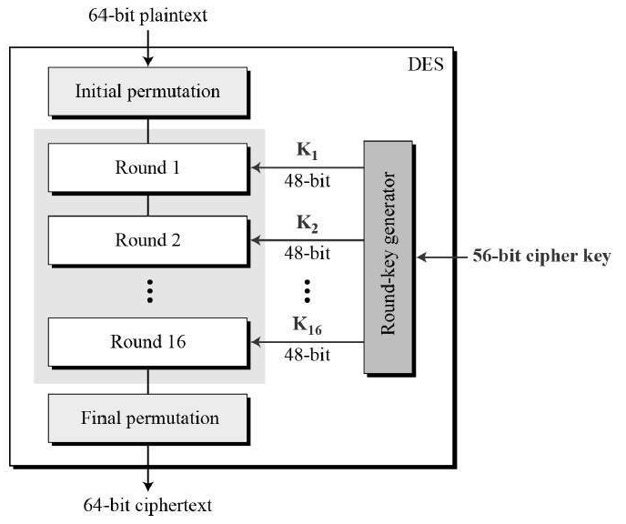

# 암호화 알고리즘 (Encryption Algorithms)

## 암호화 알고리즘이란 ?
```
정보나 데이터를 읽기 어려운 형태로 변환하여 안전하게 보호하기 위해 사용되는 수학적 기술이나 규칙의 집합이다.

기법에 따라 양방향 암호화 알고리즘과 일방향 암호화 알고리즘으로 나뉘며 그 종류가 다양하다.
```

## 암호화 알고리즘 종류

## 양방향 방식
### 대칭키 방식
```
암호화를 할 때와 복호화를 할 때 같은 암호키를 사용하는 알고리즘

블록 암호 방식: 고정된 크기의 블록 단위로 데이터를 처리하는 암호화하는 방식이다.
ex) DES, 3DES, AES, SEED

스트림 암호 방식: 유사 난수를 연속적으로 생성하여 암호문을 생성하는 방식이다.
ex) RC4
```

`블록 암호 방식`
- 이 방식에서 평문(원본 데이터)은 고정된 크기의 블록으로 나누어지고, 각 블록은 동일한 키를 사용하여 암호화 된다.
- 일반적으로 블록의 크기는 8비트[ASCII] 또는 16비트[Unicode]에 비례한다.
- 각 블록은 독립적으로 처리되며, 암호화 및 복호화에 동일한 키가 사용된다.
- Round를 사용하고, 반복적으로 암호화 과정을 수행하여 암호화 강도를 높인다. -> `확산과 혼돈`을 만족시키기 위하여 전치, 치환, 이동요소, 교환요소 등 구성요소를 결합하여 설계한다.
    ```
    - 라운드(Round) : 반복적으로 사용되는 합성 암호
    - 확산(Diffusion) : 암호문과 평문 사이의 관계를 숨기는 것
    - 혼돈(Confusion) : 암호문과 키 사이의 관계를 숨기는 것
    ```
- 블록 단위로 암호화가 수행되므로 암호화가 어디까지 진행되었는 지 내부 상태를 가질 필요가 없음

`스트림 암호 방식`
- 데이터 흐름(스트림)을 순차적으로 처리해나가는 암호 알고리즘
- 암호화 방식은 평문과 키 스트림을 XOR
- 데이터의 흐름을 순차적으로 처리해가기 때문에 내부 상태를 가지고 있음
- 블록 암호에 비해서 빠름
- 암호화 함수와 복호화 함수 동일


---

### DES(Data Encryption Standard)


```
1977년 미국 정부가 개발하여 초기에는 미국 국가 표준으로 채택된 대칭키 블록 암호화 알고리즘이다.

DES는 평문을 64비트로 나눠 56비트의 키를 이용하여 다시 64비트의 암호문을 만들어 내는 암호 알고리즘이다.

이때 암호문은 16번의 반복을 통해 만들어지는데 이때 16번의 반복동안 라운드 함수를 적용하고 이때 라운드 함수에 적용되는 키는 라운드 키이다.
이때 라운드 키는 키 스케줄에 의해 라운드 키를 발생시킨다.

DES는 파이스텔 암호 방식으로 암호화 한다.
(Feistel 네트워크라는 기본 구조 사용) 
```
DES 동작과정에 대해 잘 나와있는 사이트
```
https://www.crocus.co.kr/1210
```
### 3DES(Triple Data Encryption Standard)


```
DES는 초기에는 강력한 보안을 제공하는 것으로 여겨졌지만, 시간이 지남에 따라 컴퓨터의 처리 능력이 향상되면서 DES에 대한 공격이 더 강력해졌다.

이를위해 DES를 세 번 반복하여 사용하여 강력한 보안을 제공한다.

암호화 할때 평문 데이터가 주어지면, 처음에는 첫 번째 키를 가지고 DES로 암호화된다. 그런 다음, 이 암호문이 두 번째 키를 사용하여 복호화되고, 다시 세 번째 키를 사용하여 암호화 된다. ( 복호화 과정은 암호화 반대, 키도 거꾸로 사용됨 ) 

위 처럼 암호화(복호화) 할때 3개의 키를 필요로 하기 때문에 서로 다른 키를 만든다.
(이들 각각은 독립적으로 DES알고리즘에 적용 된다.)
(3DES 키는 DES키 56비트를 3번 곱한 값인 168비트가 된다.)
```
### AES(Advanced Encryption Standard)
```
1997년 미국에서 DES를 대체하기 위해 AES 로 불리는 암호 알고리즘을 만들었다.
높은 안전성과 효율성, 속도 등으로 인해 DES 대신 전세계적으로 많이 사용되고 있다.

AES에는 3가지 종류가 있으며 각각 AES-128, AES=192, AES-256으로 불리며 이름 그대로 키 크기가 128, 192, 256 bit 이다.
(키 길이가 길 수록 더 강력한 보안을 제공한다)

알고리즘은 고정된 128비트 블록 크기를 사용하며, 키 길이에 따라 라운드 수가 조절된다.

DES는 Feistel 네트워크라는 기본 구조를 사용하지만 AES에서는 SPN 이라는 구조를 사용하고 있다.
```
AES 동작과정
```
1. 키 스케줄링: 
    비트 키로부터 맞는 라운드 키를 생성합니다.
    (128비트 = 10개, 192비트 = 12개, 256비트 = 14개)

2. 초기 라운드:
    평문 블록과 첫 번째 라운드 키 간의 XOR 연산이 수행된다.

3. 라운드
    생성된 라운드 키 - 1(초기 라운드)개의 라운드에서 다음의 과정을 반복한다.
        - SubBytes: 16bytes의 블록을 S-Box를 사용하여 치환합니다.
        - ShiftRows: 16bytes의 블록을 행 단위로 이동시킨다.
        - MixColumns: 16bytes의 블록을 열 단위로 혼합합니다.
        - AddRoundKey: 현재 라운드 키와 블록 간의 XOR 연산을 수행한다. 

4. 최종 라운드
    마지막 라운드에서는 MixColumns가 생략되어 진행된다.
    (행렬 계산이 들어가 계산식이 복잡해지기 때문에 이 과정은 가급적 생략하는 경우가 많다.)
```
장점
```
보안: 
    보안은 높이 평가되며, 암호학자와 해커들의 수년간의 공격을 견뎌왔다.

효율성:
    계산 자원 측면에서 비교적으로 효율적이어서 광범위한 응용 분야에서 사용하기에 적합하다.

유연성:
    다양한 키 크기를 지원하므로 다양한 보안 요구사항에 적응할 수 있다.
```
단점
```
제한된 블록 크기
    128비트의 고정된 블록 크기를 가지고 있어 큰 파일을 효율적으로 암호화하는 기능을 제한할 수 있다.
    하지만 이 문제는 파일을 더 작은 블록으로 분할하여 해결할 수 있지만, 암호화 프로세스의 오버헤드와 복접성을 증가시킬 수도 있게 된다.
```
### 비대칭키 방식
```
암호화를 할 때와 복호화를 할 때 다른 암호키를 사용하는 알고리즘
```

## 단방향 방식