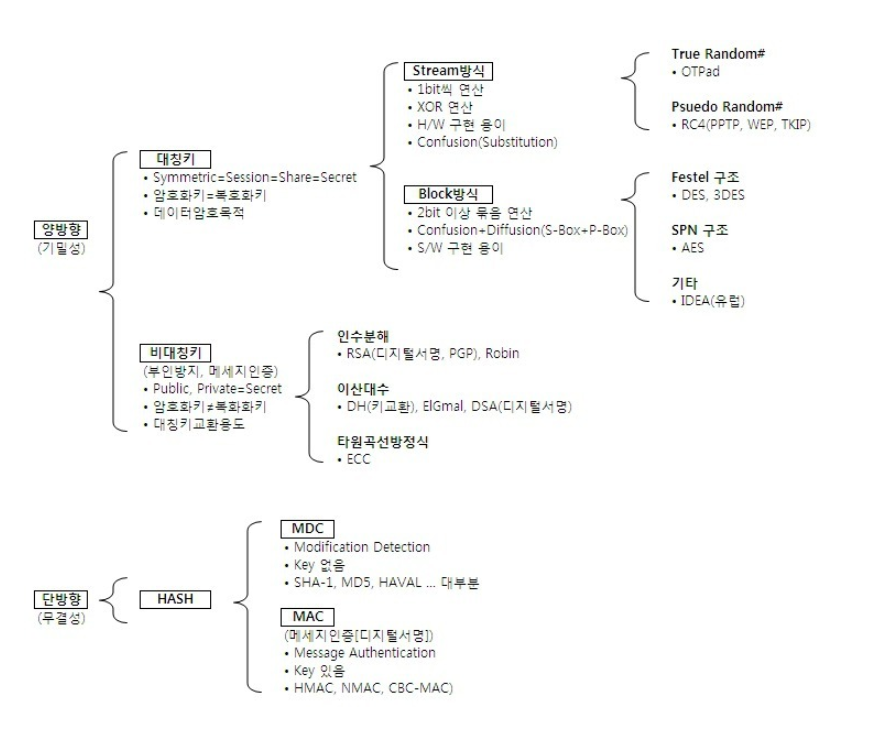

# Encryption_Algorithms

## 암호화란?


```
데이터 암호화는 데이터를 암호화 되지 않은 일반 텍스트(평문=>Plaintext)에서 암호화된 암호 텍스트(암호문=>Cipertext)로 변화하는 방법이다.

사용자는 암호화 키를 사용하여 암호화된 데이터에 액세스하고, 암호 해독 키를 사용하여 해독된 데이터에 액세스할 수 있다.

모르는 누군가가 해당 정보를 가로채도라도 이를 해독하지 못하게 보호하는 데 사용된다.
암호화는 주로 기밀성을 유지하고 데이터의 무결성을 보장하기 위해 적용된다.
다양한 정보, 통신 및 데이터 보호의 목적으로 암호화가 활용된다.

    기밀성 : 정보에 대한 접근이나 공개를 통제하는 것을 의미
    무결성 : 정보의 정확성, 일관성, 완전성이 유지되게 하는 것을 의미
```
### 양방향 암호화 (Symmetric Encryption)
```
암호화와 복호화과정을 통해 송,수신간 주고받는 메시지를 안전하게 함

키로 암호화와 복호화에 모두 사용해야 하기 때문에 안전하게 공유되야 한다.

오직 특정한 키를 가진 사람이 그 데이터를 해독할 수 있는 기밀성을 제공한다.
```
- 사용되는 키 : 하나의 키가 암호화와 복호화에 모두 사용된다. 이 키는 수신자와 송신자가 서로 공유해야 함
- 용도 : 주로 대칭 키 알고리즘을 사용하며, 주로 대용량의 데이터 전송이나 저장 시에 사용
- 속도 : 암호화와 복호화를 거처야 하기 때문에 단방향보다 느리다.
- 활용 사례 : HTTPS 통신, 디스크 암호화, VPN 등에서 사용
- 사용 알고리즘 : AES, DES, RSA, 3DES, SEED, AREA 알고리즘
#### 대칭키 
```
암.복호화키가 동일한 암호화 방식

공개키 암호화 방식에 비해 속도가 빠르다는 장점이 있지만, 키를 교환해야한다는 문제 (키 배송 문제)가 발생한다.

키를 교환하는 중 키가 탈취될 수 있는 문제도 있고 사람이 증가할수록 전부 따로따로 키 교환을 해야하기 때문에 관리해야 할 키가 방대하게 많아진다.
(이를 위해 Diffie-Hellman 키 교환에 의한 해결, 비대칭키 암호화에 의한 해결이 있다.)

대표 알고리즘 : DES, 3DES, AES, SEED, ARIA
```

#### 비대칭키 
```
암.복호화키가 다른 암호화 방식
송수신자 모두 한쌍의 키(개인 키, 공개 키)를 갖고 있게 된다.

위에서 대칭키의 키교환 문제를 해결하기 위해 등장한 것이 비대칭키(공개키라고도 함) 암호화 방식이다. 

이름 그대로 키가 공개되어있기 때문에 키를 교환할 필요가 없어지며 공개키는 모든 사람이 접근 가능한 키이고 개인키는 각 사용자만이 가지고 있는 키이다.
```

### 단방향 암호화 (Hashing Encryption)
```
해싱(Hashing)을 이용한 암호화 방식으로 양방향과는 다른 개념으로, 평문을 암호문으로 암호화는 가능하지만 암호문을 평문으로 복호화 하는 것은 불가능

해시 함수를 사용하여 데이터를 암호화 하는데 항상 고정된 크기의 출력을 생성한다.

데이터를 해시 값으로 변환하여 원본 데이터의 무결성을 확인하는 데 사용
```
- 사용되는 키 : 키 대신에 해시 함수를 사용하여 암호화 수행, 복호화가 불가능하여 복호화 키가 없음
- 용도 : 무결성 검증, 패스워드 저장, 디지털 서명 생성, 메시지 인증 등에서 사용
- 속도 : 양방향 알고리즘보다 빠르다.
- 활용 사례 : 사용자 패스워드 저장, 파일 무결성 검증, 디지털 서명 등에서 사용
- 사용 알고리즘 : Hash, SHA 알고리즘