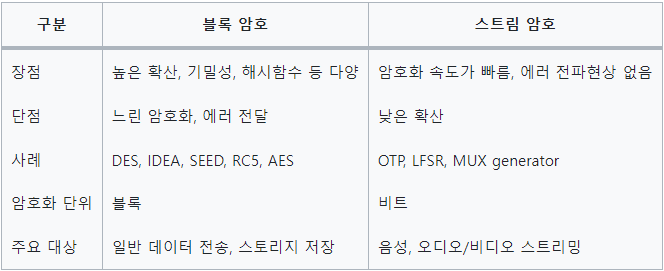
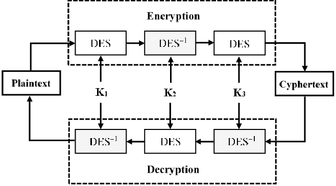
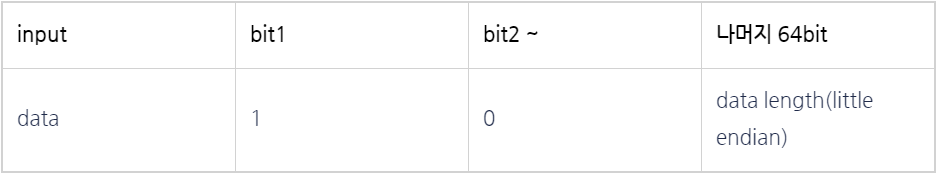

# 암호화 알고리즘 (Encryption Algorithms)

## 암호화 알고리즘이란 ?
```
정보나 데이터를 읽기 어려운 형태로 변환하여 안전하게 보호하기 위해 사용되는 수학적 기술이나 규칙의 집합이다.

기법에 따라 양방향 암호화 알고리즘과 일방향 암호화 알고리즘으로 나뉘며 그 종류가 다양하다.
```

## 암호화 알고리즘 종류

## 양방향 방식
### 대칭키 방식
```
암호화를 할 때와 복호화를 할 때 같은 암호키를 사용하는 알고리즘

블록 암호 방식: 고정된 크기의 블록 단위로 데이터를 처리하는 암호화하는 방식이다.
ex) DES, 3DES, AES, SEED

스트림 암호 방식: 유사 난수를 연속적으로 생성하여 암호문을 생성하는 방식이다.
ex) RC4
```

`블록 암호 방식`
- 이 방식에서 평문(원본 데이터)은 고정된 크기의 블록으로 나누어지고, 각 블록은 동일한 키를 사용하여 암호화 된다.
- 일반적으로 블록의 크기는 8비트[ASCII] 또는 16비트[Unicode]에 비례한다.
- 각 블록은 독립적으로 처리되며, 암호화 및 복호화에 동일한 키가 사용된다.
- Round를 사용하고, 반복적으로 암호화 과정을 수행하여 암호화 강도를 높인다. -> `확산과 혼돈`을 만족시키기 위하여 전치, 치환, 이동요소, 교환요소 등 구성요소를 결합하여 설계한다.
    ```
    - 라운드(Round) : 반복적으로 사용되는 합성 암호
    - 확산(Diffusion) : 암호문과 평문 사이의 관계를 숨기는 것
    - 혼돈(Confusion) : 암호문과 키 사이의 관계를 숨기는 것
    ```
- 블록 단위로 암호화가 수행되므로 암호화가 어디까지 진행되었는 지 내부 상태를 가질 필요가 없음

`스트림 암호 방식`
- 데이터 흐름(스트림)을 순차적으로 처리해나가는 암호 알고리즘
- 암호화 방식은 평문과 키 스트림을 XOR
- 데이터의 흐름을 순차적으로 처리해가기 때문에 내부 상태를 가지고 있음
- 블록 암호에 비해서 빠름
- 암호화 함수와 복호화 함수 동일



---

### DES(Data Encryption Standard)


```
1977년 미국 정부가 개발하여 초기에는 미국 국가 표준으로 채택된 대칭키 블록 암호화 알고리즘이다.

DES는 평문을 64비트로 나눠 56비트의 키를 이용하여 다시 64비트의 암호문을 만들어 내는 암호 알고리즘이다.

이때 암호문은 16번의 반복을 통해 만들어지는데 이때 16번의 반복동안 라운드 함수를 적용하고 이때 라운드 함수에 적용되는 키는 라운드 키이다.
이때 라운드 키는 키 스케줄에 의해 라운드 키를 발생시킨다.

DES는 파이스텔 암호 방식으로 암호화 한다.
(Feistel 네트워크라는 기본 구조 사용) 
```
DES 동작과정에 대해 잘 나와있는 사이트
```
https://www.crocus.co.kr/1210
```
### 3DES(Triple Data Encryption Standard)


```
DES는 초기에는 강력한 보안을 제공하는 것으로 여겨졌지만, 시간이 지남에 따라 컴퓨터의 처리 능력이 향상되면서 DES에 대한 공격이 더 강력해졌다.

이를위해 DES를 세 번 반복하여 사용하여 강력한 보안을 제공한다.

암호화 할때 평문 데이터가 주어지면, 처음에는 첫 번째 키를 가지고 DES로 암호화된다. 그런 다음, 이 암호문이 두 번째 키를 사용하여 복호화되고, 다시 세 번째 키를 사용하여 암호화 된다. 
여기서 서로 다른 키로 암호화 된 암호문을 복호화 할 수 있나 싶을 수 있지만
복호화 과정에선 원래의 평문이 아니라 중간값이라고 하며 암호화 되기 전의 평문이 아니다.
( 복호화 과정은 암호화 반대, 키도 거꾸로 사용됨 ) 

위 처럼 암호화(복호화) 할때 3개의 키를 필요로 하기 때문에 서로 다른 키를 만든다.
(이들 각각은 독립적으로 DES알고리즘에 적용 된다.)
(3DES 키는 DES키 56비트를 3번 곱한 값인 168비트가 된다.)
```
### AES(Advanced Encryption Standard)
```
1997년 미국에서 DES를 대체하기 위해 AES 로 불리는 암호 알고리즘을 만들었다.
높은 안전성과 효율성, 속도 등으로 인해 DES 대신 전세계적으로 많이 사용되고 있다.

AES에는 3가지 종류가 있으며 각각 AES-128, AES-192, AES-256으로 불리며 이름 그대로 키 크기가 128, 192, 256 bit 이다.
(키 길이가 길 수록 더 강력한 보안을 제공한다)

알고리즘은 고정된 128비트 블록 크기를 사용하며, 키 길이에 따라 라운드 수가 조절된다.

DES는 Feistel 네트워크라는 기본 구조를 사용하지만 AES에서는 SPN 이라는 구조를 사용하고 있다.
```
AES 동작과정
```
1. 키 스케줄링: 
    비트 키로부터 맞는 라운드 키를 생성합니다.
    (128비트 = 10개, 192비트 = 12개, 256비트 = 14개)

2. 초기 라운드:
    평문 블록과 첫 번째 라운드 키 간의 XOR 연산이 수행된다.

3. 라운드
    생성된 라운드 키 - 1(초기 라운드)개의 라운드에서 다음의 과정을 반복한다.
        - SubBytes: 16bytes의 블록을 S-Box를 사용하여 치환합니다.
        - ShiftRows: 16bytes의 블록을 행 단위로 이동시킨다.
        - MixColumns: 16bytes의 블록을 열 단위로 혼합합니다.
        - AddRoundKey: 현재 라운드 키와 블록 간의 XOR 연산을 수행한다. 

4. 최종 라운드
    마지막 라운드에서는 MixColumns가 생략되어 진행된다.
    (행렬 계산이 들어가 계산식이 복잡해지기 때문에 이 과정은 가급적 생략하는 경우가 많다.)
```
장점
```
보안: 
    보안은 높이 평가되며, 암호학자와 해커들의 수년간의 공격을 견뎌왔다.

효율성:
    계산 자원 측면에서 비교적으로 효율적이어서 광범위한 응용 분야에서 사용하기에 적합하다.

유연성:
    다양한 키 크기를 지원하므로 다양한 보안 요구사항에 적응할 수 있다.
```
단점
```
제한된 블록 크기
    128비트의 고정된 블록 크기를 가지고 있어 큰 파일을 효율적으로 암호화하는 기능을 제한할 수 있다.
    하지만 이 문제는 파일을 더 작은 블록으로 분할하여 해결할 수 있지만, 암호화 프로세스의 오버헤드와 복접성을 증가시킬 수도 있게 된다.
```
### 비대칭키 방식
```
암호화를 할 때와 복호화를 할 때 다른 암호키를 사용하는 알고리즘
전자 서명 및 공인인증서 등 다양한 곳에서 이용한다.

비대칭키 알고리즘은 수학적인 개념으로 종류를 나눌 수 있다.

소인수분해 : 소인수분해는 어떤 정수를 소수의 곱으로 분해하는 것을 의미한다.
ex) RSA

이산대수 : 연속적이지 않고 끊어진 개별적인 값을 다루는 수학의 한 분야
ex) DH

타원 곡선 : 타원 곡선은 암호학에서 사용되는 수학적인 구조로, 이산 대수의 원리를 활용한다.
ex) ECC
```
### DH
```
두 디바이스의 개인키를 공유하지 않고 대칭키를 만드는 방식으로, 대칭키가 키를 교환할때 탈취당하는 "키 교환" 문제를 해결하기 위해서 1976년에 Diffie 와 Hellman 에 의해 만들어진 알고리즘 이다. 
```
동작원리
```
A와 B라는 디바이스가 있고, 공개적으로 발생기(Generator)를 생성한다. 
이는 g라고 하고 우리가 mod 할 값 p는 소수로 지정한다.

1. A는 개인키 a를 이용하여 g^a mod p(간단히 GA라고 한다)를 생성
2. B는 개인키 b를 이용하여 g^b mod p(간단히 GB라고 한다)를 생성
3. 이제 A는 B에게 GA를 보내고 B는 A에게 GB를 보낸다.
4. A는 자신의 개인키 a를 이용하여 g^ab mod p(g^b^a mod p)를 만들고 B는 자신의 개인키 b를 이용하여 g^ab mod p(g^a^b mod p)를 만든다.
5. 마지막으로 A와 B가 교환하여 결합한 값이 서로 같은지를 확인
6. A와 B는 새롭게 생성된 키를 대칭키(비밀키)로 이용한다.
```

### RSA
```
주로 기밀성을 위한 암호화 및 디지털 서명을 위한 서명에 사용되어, 
데이터의 안전한 전송 및 인증에 활용되기 위해 1977년에 Ron, Shamir, Adleman 세명의 수학자에 의해 만들어진 알고리즘이다.

암호화 뿐만 아니라 전자서명이 가능한 최초의 알고리즘
수학적으로 엄청나게 큰 숫자의 소인수 분해가 어렵다는 사실을 기반으로 만들어졌다.
```
동작 과정
```
1. 두 소수(p, q) 선택:
    두 개의 큰 소수인 p와 q를 선택한다.
    이 소수는 무작위로 선택되며, 보통 수백 비트 이상의 길이를 가지게 된다.
    
2. n 계산:
    두 소수의 곱인 n = pq를 계산한다.

3. 오일러 파이 함수(φ 함수) 계산:
    오일러 파이 함수(φ 함수)는 (p−1)(q−1) 이다.
    이 함수는 n과 서로소인 수의 개수를 나타낸다.

4. 공개 키 e 선택:
    공개 키 e는 1과 오일러 파이 함수의 값 사이에서 함수 값과 서로소인 수로 선택된다.
    보통 e는 작은 소수를 사용합니다.

5. 개인 키 d 계산:
    개인 키 d 는 ed ≡ 1을 만족하는 d를 계산 해야한다.
    여기서는 확장 유클리드 알고리즘 등을 사용하여 계산한다.
```

### ECC
```
Elliptic Curve Cryptography 으로 타원 곡선의 수학적 속성을 기반이며, RSA 암호방식에 대한 대안으로 1985년에 제안된 알고리즘이다.

RSA와 비교하여 효율적이며 안전한 키 교환 및 디지털 서명에 사용된다.

ECC는 키 크기가 작으면서도 안전성이 높은 특징을 갖고 있기 때문에, 특히 제한된 자원을 갖는 환경에서 유용하게 사용된다.
```

## 단방향 방식
### Hash 
```
임의의 크기를 가진 데이터를 고정된 크기의 고유한 해시 값으로 변환하는 함수

이러한 해시 값은 일반적으로 고정된 길이의 이진 문자열로 표현되며, 입력 데이터의 어떤 부분이라도 조금이라도 변경되면 완전히 다른 해시 값이 생성되어 데이터의 무결성을 보장한다.
```
### MD5
```
Message-Digest Algorithms 5
1991년에 로널드 라이베스트가 이전에 쓰이던 MD4를 대체하기 위해 고안된 알고리즘이다.
(로널드 라이베스트는 RSA에서 R을 맡고 계신 분이다.)

하지만 2004년에 더욱 심한 결함이 발견되었고, 2006년에 노트북 한대로 1분 내에 해시 충돌을 찾을 수 있을 정도의 빠른 알고리즘이 발표되어 현재는 거의 사용되지 않고 있다.

임의의 길이의 메시지를 입력받아서 128비트짜리 고정 길이의 출력값을 낸다.
입력 메시지는 512비트 블록들로 쪼개지는데 패딩을 사용하여 512로 나누어 떨어지게 한다.
```



```
패딩 기준에는 65bit가 추가되기 때문에 input data가 448bit를 넘는다면 1024bit로 Plaintext를 크게 만들어준다.
```
### SHA-1
```
Secure Hash Algorithms 1은 160비트의 해시 값을 생성하는 알고리즘
SHA-0을 변형한 SHA 함수들 중 하나이며, 1995년 발표되었다.

MD5 해시 함수에서 사용했던 것과 비슷한 방법을 사용한다.

충돌공격에 취약하다는 단점이 있음.
```
### SHA-256, SHA-384, SHA-512
```
이들은 Secure Hash Algorithms 2 계열에 속한 알고리즘으로, 각각 256, 384, 512 비트의 해시 값을 생성한다.

SHA-256이 가장 널리 사용되며, 안전한 해시 함수로 여겨진다.
```
### SHA-3
```
Secure Hash Algorithms 3은 Keccak 알고리즘을 기반으로 하는 해시 함수이다.

SHA-2 와는 완전히 다른 구조를 가지며, 높은 수준의 보안성을 제공한다.
```
