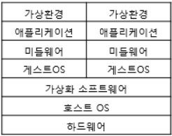
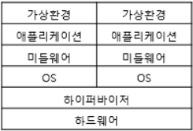
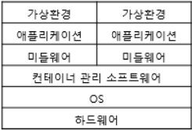

# Virtualization 

## 가상화란 ?
- 하드웨어, 운영 체제, 네트워크 등의 IT 자원을 논리적으로 분할하여 가상으로 만드는 기술을 의미
- 가상 소프트웨어는 물리적 하드웨어 기능을 모방하여 하나의 물리적 머신에서 여러 가상 시스템을 동시에 실행한다.
- 기업은 가상화를 사용해 하드웨어 리소스를 효율적으로 사용하여 투자 대비 이익을 더 많이 얻을 수 있습니다.
- 또한 클라우드 컴퓨팅 서비스를 지원하여 조직의 인프라를 더욱 효율적으로 관리 할 수 있다.

## Virtual Machine, Hypervisor
- 가상 머신과 하이퍼바이저는 가상화에서 두 가지 중요한 개념이다.

### Virtual Machine 
```
가상 머신은 별도의 운영 체제와 컴퓨팅 리소스가 있는 물리적 컴퓨터에서 실행되는 소프트웨어 정의 컴퓨터이다.

물리적 시스템을 "호스트 머신"이라고 하고 가상 머신을 "게스트 머신"이라고 한다.
하나의 물리적 시스템에서 여러 가상 머신을 실행 할 수 있다.

가상 머신은 하이퍼바이저에 의해 컴퓨터 하드웨어에서 추상화된다.
```

### Hypervisor
```
하이퍼바이저는 한 컴퓨터에서 여러 가상 머신을 관리하는 소프트웨어 구성 요소이다.

이는 각 가상 머신이 할당된 리소스를 얻고 다른 가상 머신의 작동을 방해하지 않도록 한다.

하이퍼바이저에는 두 가지 유형이 있다.
```


- Type 1 Hypervisor(Bare Metal Hypervisor)
```
운영 체제 대신 컴퓨터 하드웨어에 직접 실행되는 하이퍼바이저 프로그램이다.
일반적으로 운영 체제의 부팅 전에 로드되며, 운영 체제는 하이퍼바이저 위에 실행된다.

따라서 1형 하이퍼바이저는 더 나은 성능을 가지며 엔터프라이즈 애플리케이션에서 일반적으로 사용된다.

KVM(Kennel Virtual Machine)은 1형 하이퍼바이저를 사용하여 Linux 운영 체제에서 여러 가상 머신을 호스팅한다.
```
- Type 2 Hypervisor(Hosted Hypervisor)
```
운영 체제에 직접 실행되는 하이퍼바이저 프로그램이다.
호스트 운영 체제 위에서 애플리케이션으로써 실행되며, 사용자는 이 애플리케이션을 통해 가상 머신을 관리한다.

2형 하이퍼바이저는 최종 사용자 컴퓨팅에 적합하다.

VMware Workstation은 2형 하이퍼바이저를 사용하여 Windows 및 Linux에서 가상 머신을 호스팅한다.
```

## 가상화 기술 종류
```
가상화의 종류로는 구동되는 방식에 따라 3가지로 나뉜다.

1. 호스트 가상화
2. 하이퍼바이저 가상화
3. 컨테이너 가상화
```
### Host Virtualization


- 호스트 가상화는 Base가 되는 Host OS 위에 Guest OS가 구동되는 방식이다.
- 종류로는 VM Workstation, VMware Server, Virtual Box 등이 있다.
- 장점 :
  -  가상의 하드웨어를 에뮬레이팅하기 때문에 호스트 운영체제에 크게 제약사항이 없음
- 단점 : 
  -  OS위에 OS가 얹히는 방식이기 때문에 오버헤드가 클 수 있음
---
### Hypervisor Virtualization


- 위에 설명해준 가상화 이다.
- 하이퍼바이저는 다시 전가상화(Full Virtualization)과 반가상화(Para Virtualization)로 분류 된다.

#### 전가상화
```
전가상화는 하드웨어를 완전히 가상화하는 방식으로,
하이퍼바이저를 구동하면 DOM0라고 하는 관리용 가상 머신이 실행되며, 모든 가상머신들의 하드웨어 접근이 DOM0을 통해서 이루어진다.
즉, 모든 명령에 대해서 DOM0가 개입을 하게되는 형태이다.

쉽게 말해 하이퍼바이저는 가상화된 OS가 뭐든지간에 각 OS들이 내리는 명령어를 알아들을 수 있다.
예를들어 윈도우 에서 Add, 리눅스 에서 ADD, 맥에서 add 라는 명령어를 내렸을때  하이퍼바이저가 “더해라”라고 번역 하여 명령어를 실행해주는 것이다.
하이퍼바이저는 이러한 번역 역할 뿐만 아니라 가상화된 OS들에게 자원을 할당해주는 역할도 담당한다.

장점 : 
하드웨어를 완전히 가상화하기 때문에 Guest OS 운영체제의 별다른 수정이 필요 없음

단점 :
하이퍼바이저가 모든 명령을 중재하기 때문에 성능이 비교적 느림
```
#### 반가상화
```
반가상화는 전가상화와 달리 하드웨어를 완전히 가상화 하지 않는다.

전가상화의 가장큰 단점인 성능저하의 문제를 해결하기 위해 하이퍼콜(Hyper Call)이라는 인터페이스를 통해 하이퍼바이저에게 직접 요청을 날릴 수 있다.

쉽게 말하면 가상화된 각 OS들이 각각 다른 번역기를 갖고 있는 것입니다. 그 번역기는 각각 다른 OS에서 내리는 각각 다른 명령어를 “더해라”라고 번역해주게 되는 것입니다.

장점 :
모든 명령을 DOM0를 통해 하이퍼바이저에게 요청하는 전가상화에비해 성능이 빠름

단점 :
하이퍼바이저에게 Hyper Call 요청을 할 수 있도록 각 OS의 커널을 수정해야하며 오픈소스 OS가 아니면 반가상화를 이용하기가 쉽지 않음
```
---
### Container Virtualization


- Host 가상화처럼 호스트 OS위에 컨테이너관리 소프트웨어를 설치하여, 논리적으로 컨테이너를 나누어 사용한다.
- 컨테이너에는 게스트OS나 가상하드웨어를 포함하지 않는다는 점이 호스트OS형과 다른점이다.
- 종류로는 Docker와 Kubernates 등이 있다.
- 장점 :
  - 컨테이너 가상화는 오버헤드가 적어 가볍고 빠른 장점이 있음
- 단점 : 
  - 컨테이너는 호스트 운영 체제의 커널을 공유하기 때문에 호스트와 컨테이너의 운영 체제 버전이나 커널 버전이 호환되어야 함