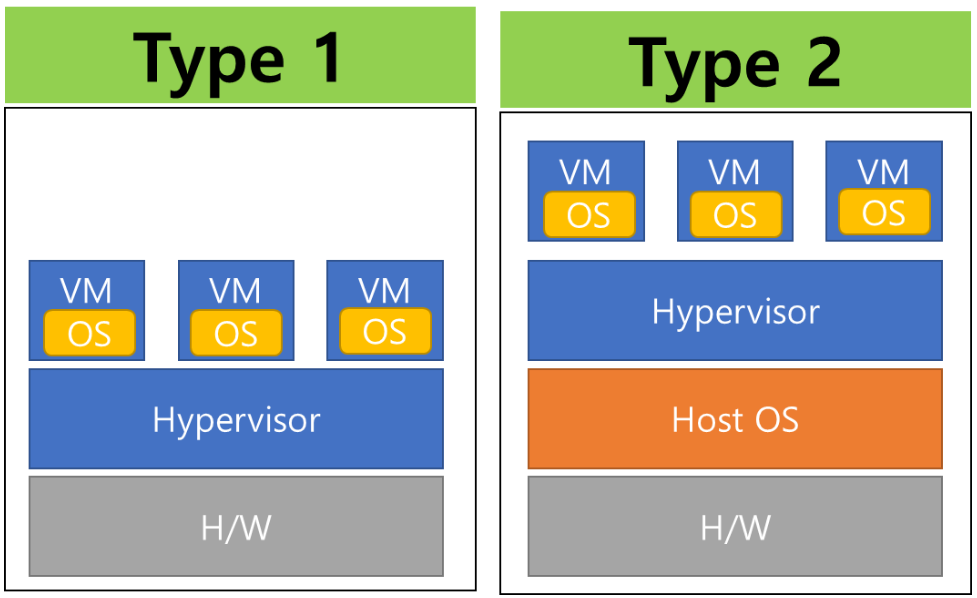

# Virtualization 

## 가상화란 ?
- 하드웨어, 운영 체제, 네트워크 등의 IT 자원을 논리적으로 분할하여 가상으로 만드는 기술을 의미
- 가상 소프트웨어는 물리적 하드웨어 기능을 모방하여 하나의 물리적 머신에서 여러 가상 시스템을 동시에 실행한다.
- 기업은 가상화를 사용해 하드웨어 리소스를 효율적으로 사용하여 투자 대비 이익을 더 많이 얻을 수 있습니다.
- 또한 클라우드 컴퓨팅 서비스를 지원하여 조직의 인프라를 더욱 효율적으로 관리 할 수 있다.

## Virtual Machine, Hypervisor
- 가상 머신과 하이퍼바이저는 가상화에서 두 가지 중요한 개념이다.

### Virtual Machine 
```
가상 머신은 별도의 운영 체제와 컴퓨팅 리소스가 있는 물리적 컴퓨터에서 실행되는 소프트웨어 정의 컴퓨터이다.

물리적 시스템을 "호스트 머신"이라고 하고 가상 머신을 "게스트 머신"이라고 한다.
하나의 물리적 시스템에서 여러 가상 머신을 실행 할 수 있다.

가상 머신은 하이퍼바이저에 의해 컴퓨터 하드웨어에서 추상화된다.
```

### Hypervisor
```
하이퍼바이저는 한 컴퓨터에서 여러 가상 머신을 관리하는 소프트웨어 구성 요소이다.

이는 각 가상 머신이 할당된 리소스를 얻고 다른 가상 머신의 작동을 방해하지 않도록 한다.

하이퍼바이저에는 두 가지 유형이 있다.
```


- Type 1 Hypervisor(Bare Metal Hypervisor)
```
운영 체제 대신 컴퓨터 하드웨어에 직접 실행되는 하이퍼바이저 프로그램이다.
일반적으로 운영 체제의 부팅 전에 로드되며, 운영 체제는 하이퍼바이저 위에 실행된다.

따라서 1형 하이퍼바이저는 더 나은 성능을 가지며 엔터프라이즈 애플리케이션에서 일반적으로 사용된다.

KVM(Kennel Virtual Machine)은 1형 하이퍼바이저를 사용하여 Linux 운영 체제에서 여러 가상 머신을 호스팅한다.
```
- Type 2 Hypervisor(Hosted Hypervisor)
```
운영 체제에 직접 실행되는 하이퍼바이저 프로그램이다.
호스트 운영 체제 위에서 애플리케이션으로써 실행되며, 사용자는 이 애플리케이션을 통해 가상 머신을 관리한다.

2형 하이퍼바이저는 최종 사용자 컴퓨팅에 적합하다.

VMware Workstation은 2형 하이퍼바이저를 사용하여 Windows 및 Linux에서 가상 머신을 호스팅한다.
```

## 가상화 기술 종류
```
가상화 기술에는 다양한 종류가 있다.
대표적으로 하이퍼바이저를 이용한 전가상화(Full Virtualization)와 반가상화(Paravirtualization), 컨테이너(Container) 기반의 가상화 기술인 도커(Docker) 등이 있다.
```

### 전가상화
- 정의 : 
    - 전가상화는 가상머신이 실제 하드웨어와 완전히 동일한 환경에서 실행되도록 하는 가상화 기술
- 특징 :
    - 가상머신은 호스트 시스템에서 완전한 게스트 운영 체제를 실행하며, 게스트 운영 체제는 자신이 원래 설계된 대로 하드웨어와 상호 작용한다.
    - 하드웨어 가상화 확장기술을 사용하여 가상머신이 직접 하드웨어에 액세스할 수 있도록 한다.
    - 대부분의 일반적인 운영 체제들은 전가상화에 사용될 수 있다.
- 장점 :
    - 게스트 운영 체제에 대한 수정 없이 기존 운영 체제를 가상머신으로 실행할 수 있다.
    - 호스트와 게스트 간에 높은 호환성을 제공한다.
- 단점
    - 가상머신이 하드웨어에 직접 액세스하지 못하면서 발생하는 오버헤드가 있다.

### 반가상화
- 정의 :
    - 반가상화는 가상머신이 호스트 시스템과 협력하여 하드웨어와 상호 작용하는 가상화 기술이다.
- 특징 :
    - 게스트 운영 체제가 특별한 수정을 가진 상태에서 실행된다. 이러한 수정은 하드웨어와의 상호 작용을 개선하기 위한 것이다.
    - 게스트 운영 체제는 호스트 시스템에  하드웨어 상태를 직접 요청하고, 호스트 시스템은 이러한 요청에 응답한다.
    - 전가상화보다 낮은 오버헤드와 높은 성능을 제공할 수 있다.
- 장점 :
    - 성능이 향상되며, 오버헤드가 감소한다.
    - 가상머신이 직접 하드웨어에 접근하는 것보다 빠른 입출력 처리가 가능하다
- 단점
    - 게스트 운영 체제에 대한 수정이 필요하므로, 기존 운영 체제를 수정하지 않은 채로 가상화 하기 어렵다.
    - 일부 운영 체제는 반가상화를 지원하지 않을 수 있다.
    