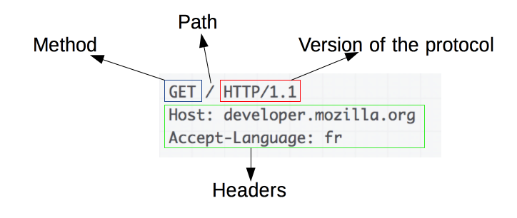
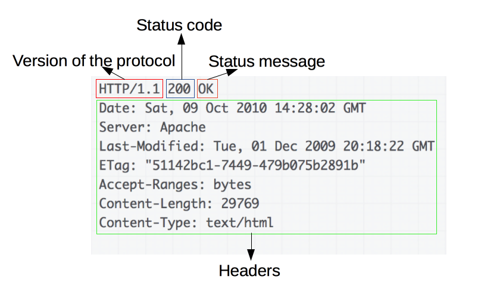

# HTTP

## HTTP(Hyper Text Transfer Protocol) 란 ?
```
텍스트 기반의 통신 규약으로 인터넷, 월드 와이드 웹(WWW)에서 데이터를 주고받을 수 있는 프로토콜이다.

이렇게 규약을 정해두었기 때문에 모든 프로그램이 이 규약에 맞춰 개발해서 서로 정보를 교환할 수 있다.

주로 HTML 문서를 주고 받는 데 사용된다.
```

## 특징
- HTTP Message 는 HTTP Server와 HTTP Client에 의해 해석 된다.

- TCP/IP를 이용하는 응용 프로토콜이다.

- HTTP는 연결 상태를 유지하지 않는 비연결성 프로토콜이다. (이러한 단점을 해결하기 위해 Cookie와 Session이 등장하였다.)

- 클라이언트/서버 모델이기 때문에 클라이언트는 요청(Request)하고, 서버는 응답(Response)하는 방식이다.

### Request
```
클라이언트가 서버에게 연락하는 것을 요청이라 한다.
```
#### Request Method (요청의 종류, 흔하게 사용하는 Method 4가지)

- GET : 
    - `리소스 조회`
    - 리소스를 요청할 때 사용
- POST : 
    - `데이터 전송`
    - 리소스의 생성을 요청할 때 사용
- PUT : 
    - `리소스 업로드 또는 생성`
    - 리소스의 수정을 요청할 때 사용
- DELETE : 
    - `리소스 삭제`
    - 리소스의 삭제를 요청할 때 사용

#### Request Message
ex)


1. Start Line (첫 줄)
    ```
    첫 줄은 시작줄로 메서드 구조 버전으로 다음과 같이 구성된다.
    ```
    - HTTP Method
    - 요청 대상 URL
    - HTTP 버전
2. Header Field (두 번째 줄부터)
    ```
    두 번째 줄부터는 헤더이며 요청에 대한 정보를 담고 있고 다음과 같이 이루어진다.
    ```
    - Host : 요청을 받을 호스트의 도메인 또는 IP 주소
    - User-Agent : 클라이언트 소프트웨어 정보
    - Content-Type : 요청 본문의 데이터 타입
    - 기타 등등..
3. Blank Line (빈 줄)
    - 헤더와 본문을 구분하는 빈 줄이 삽입된다.

4. Message Body (메시지 본문)
    - 필수는 아니지만, 요청에 데이터가 포함되어야 할 경우에 사용됩니다.
    - 주로 POST 메서드 등에서 사용된다.

### Response
```
서버가 요청에 대한 답변을 클라이언트에게 보내는 것을 응답이라고 한다.
```

#### Status Code 
```
상태 코드에는 굉장히 많은 종류가 있다.
모두 숫자 세 자리로 이루어져 있으며, 아래와 같이 크게 다섯 부류로 나눌 수 있다.

1. 1XX (조건부 응답) : 요청을 받았으며 작업을 계속한다.
2. 2XX (성공) : 클라이언트가 요청한 동작을 수신하여 이해했고 승낙했으며 성공적으로 처리했음을 가리킨다
3. 3XX (리다이렉션 완료) : 클라이언트는 요청을 마치기 위해 추가 동작을 취해야 한다.
4. 4XX (요청 오류) : 클라이언트에 오류가 있음을 나타낸다.
5. 5XX (서버 오류) : 서버가 유효한 요청을 명백하게 수행하지 못했음을 나타낸다.
```

#### Response Message
ex)


1. Start Line (첫 줄)
    ```
    첫 줄은 버전 상태코드 상태메시지로 구성되어 있다.
    ```
    - HTTP 버전
    - Status Code
    - Status Message
2. Header Field (두 번째 줄 부터)
    ```
    두 번째 줄부터는 헤더로 응답에 대한 정보를 담고 있다.
    ```
    - Content-Type : Response Body 의 데이터 타입
    - Content-Length : Response Body 의 길이
    - 기타 등등..
3. Blank Line (빈 줄)
    - 헤더와 본문을 구분하는 빈 줄이 삽입된다.
    
4. Message Body (메시지 본문)
    - Request Message와 마찬가지로 필수는 아니지만, 응답에 데이터가 포함되어야 할 경우에 사용된다.
    - HTML 문서, 이미지 등이 여기에 포함될 수 있다.

## 무상태(Stateless)
- Stateful은 서버가 클라이언트의 이전 상태를 보존한다는 의미이다.
- 반대로 Stateless는 서버가 클라이언트의 이전 상태를 보존하지 않는다는 의미.
- 예시
    ```
    Stateful

    승객: 서울에서 전주 가는 KTX는 얼마인가요?
    직원: 25,000원입니다.

    승객: 2장 주세요.
    직원: 50,000원입니다. 결제는 무엇으로 하시겠습니까? (KTX 노선과 주문 수량에 대한 상태를 유지)

    승객: 체크카드입니다.
    직원: 결제과 완료되었습니다. (KTX 노선과 주문 수량, 결제 수단에 대한 상태를 유지)
    ```
    ```
    Stateless

    승객: 서울에서 전주 가는 KTX는 얼마인가요?
    직원: 25,000원입니다.

    승객: 2장 주세요.
    직원: ??? 무엇을 2장 구매하시는 건가요???

    승객: 아까 말했잖아요😳. 서울에서 전주 가는 KTX요!!!
    직원: 몇 장인지, 결제 수단은 무엇인지 한 번에 얘기해주세요!
    ```

    - Stateful은 우리가 일상에서 대화를 할 때와 비슷하다. 대화를 주고 받을 때 마다(요청과 응답) 상대는 문맥의 상태를 유지한다.
    - Stateless에서는 대화가 오고 갈 때 마다 상대는 그 문맥의 상태를 모른 체 대화를 한다고 본면 된다. 

- Stateful의 경우에는 상태를 유지해야 하므로 항상 같은 서버가 유지되어야 한다.
- Stateless는 상태를 보관하지 않으므로 클라이언트의 요청에 어느 서버가 응답해도 상관이 없다.
    - 따라서 클라이언트의 요청이 대폭 증가해도 서버를 증설해 해결할 수 있다.
        ```
        하지만 모든 것을 Stateless로 설계할 수 없다. 

        단순히 로그인만 보더라도 사용자가 로그인한 상태를 서버에 유지시켜 주어야 한다.
        이 경우에는 브라우저 쿠키나 서버 세션 등을 사용해 상태를 유지한다.
        ```

## 비연결성(Connectionless)
- 비연결성은 클라이언트가 서버에 요청을 하고 응답을 받으면 바로 TCP/IP 연결을 끊어 연결을 유지 하지 않는 것이다.
- 이를 통해 서버의 자원을 효율적으로 관리하고, 수 많은 클라이언트의 요청에도 대응할 수 있게 한다.
- HTTP는 연결을 유지하지 않는 모델을 기본으로 한다.
- 수 천명이 서비스를 사용해도 실제 서버에서 동시에 처리하는 요청은 수 십개 이하로 작다.
    - 예를 들어 구글을 수 천명이 이용해도 검색을 수 천명이 동시에 이용하지 않는다.
    - 하지만 콘서트 예매처럼 정말 수 십만명이 한꺼번에 몰리는 경우도 있다.

### 한계
- 연결이 끊어짐에 따라 새로 연결될 때 TCP/IP 연결을 새로 맺어야 하므로 3-way-handshake에 따른 시간이 추가된다.
- HTMl 뿐만 아니라 자바스크립트, CSS, 이미지 등 수 많은 자원이 함께 다운로드된다.

### 해결
- 현재는 HTTP 지속 연결(Persisten Connections)로 문제를 해결했다.
- 지속 연결은 요청에 따라 연결이 된 이후 일정 시간 연결을 유지하거나 여러 개의 요청(HTML, 자바스크립트, 이미지 등)에 대한 응답이 다 올 까지 기다린 후 연결을 종료하는 것이다.