# HTTP_Method 

## 종류
```
클라이언트와 서버 사이에 이루어지는 요청(Request)과 응답(Response) 데이터를 전송하는 방식

서버에 주어진 리소스에 수행하길 원하는 행동, 서버가 수행해야 할 동작을 지정하는 요청을 보내는 방법이다.

HTTP 메소드의 종류는 총 9가지가 있다. 이 중 주로 쓰이는 메소드는 5가지로 보면 된다.

"주요 메소드"
GET : 리소스 조회
POST : 요청 데이터 처리, 주로 등록에 사용
PUT : 리소스를 대체(덮어쓰기), 해당 리소스가 없으면 생성
PATCH : 리소스 부분 변경 (PUT이 전체 변경, PATCH는 일부 변경)
DELETE : 리소스 삭제

"기타 메소드"
HEAD : GET과 동일하지만 메시지 부분(Body 부분)을 제외하고, Status Line과 Header 반환
OPTIONS : 대상 리소스에 대한 통신 가능 옵션(메서드)을 설명(주로 CORS에서 사용)
CONNECT : 대상 리소스로 식별되는 서버에 대한 터널을 설정
TRACE : 대상 리소스에 대한 경로를 따라 메시지 루프백 테스트를 수행
```

## `GET`
- `리소스 조회 메서드` [READ]
- 만일 서버에 전달하고 싶은 데이터는 `쿼리스트링`를 통해서 전달
    - ex) GET /members/100?username=inpa&height=200
- 쿼리스트링 외에 메시지 바디를 사용해서 데이터를 전달할 수 있지만, 서버에서 따로 구성해야 되기 때문에 지원하지 않는 곳이 많아서 권장하지 않음
- 조회할 때 POST도 사용할 수 있지만, GET 메서드는 캐싱이 가능하기에 GET을 사용하는 것이 유리하다.

### 정적 데이터 조회 과정
---
1. 클라이언트에서 `/members/100`으로 100번 맴버를 조회해서 정보를 달라고 GET 요청
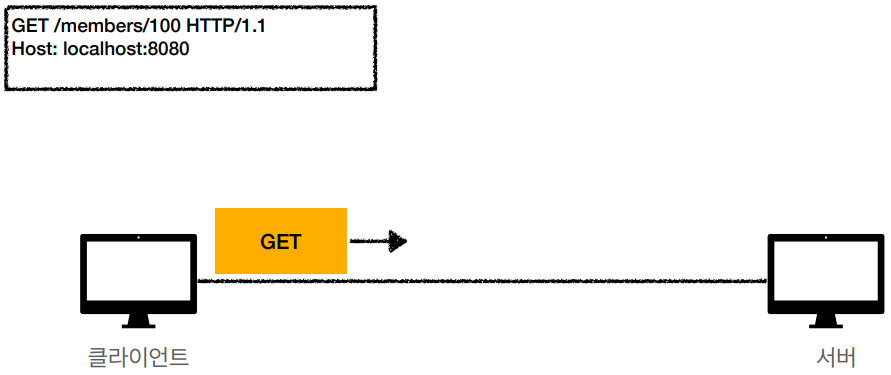

2. 서버에서는 요청 메세지를 분석해 내부의 유저정보를 조회한 뒤 결과 Response를 만든다.
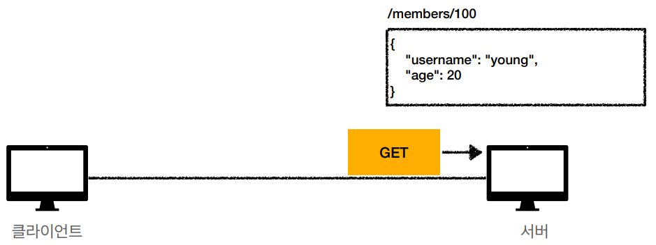

3. 서버에서 클라이언트로 응답을 해준다. 클라이언트에서 정상적으로 받으면 200 OK Status를 가지며, 회원정보를 얻게 된다.
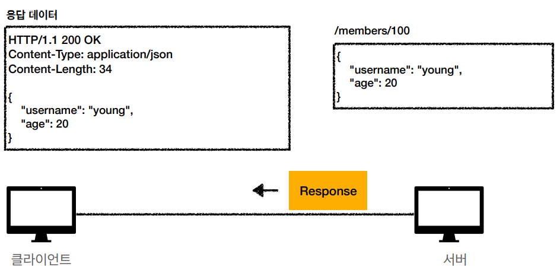

### 동적 데이터 조회 과정
---
1. 요청 URL 뒤에 ?q=hello&hl=ko 쿼리 파라미터를 줘서 상세한 조회 데이터를 얻는다.
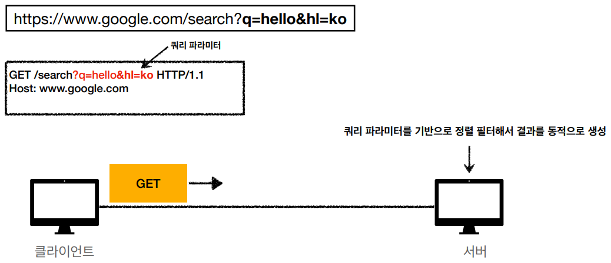

2. 서버는 요청에 따라 데이터베이스나 다른 소스로부터 데이터를 가져와서 동적으로 페이지를 생성한다.

3. 서버는 생성된 페이지를 클라이언트에게 응답으로 전송한다.

### 정적 조회와 동적 조회 차이점
```
정적 데이터는 미리 만들어져 있어 변하지 않고, 여러 클라이언트에게 동일한 내용을 제공한다.

동적 데이터는 요청 시에 생성되며, 데이터 소스에 따라 결과가 달라질 수 있다.
동적 데이터는 사용자에 따라 다른 컨텐츠를 제공할 수 있다.

웹 애플리케이션에서는 정적 데이터와 동적 데이터를 조합하여 다양한 형태의 콘텐츠를 제공하는 것이 일반적이다.
```

### HTML Form 데이터 조회 과정
---
- HTML Form 태그 문서로 사용자와 UI로 상호작용하여 서버와 통신
- HTML Form 전송은 GET, POST만 지원
1. 웹문서에서 폼 입력칸에 데이터를 적고 전송 버튼을 누른다.
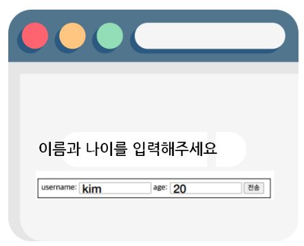

2. 지정한 GET 메서드 동작에 따라 input 태그안에 들어간 값들이 쿼리스트링으로 서버로 전달된다.
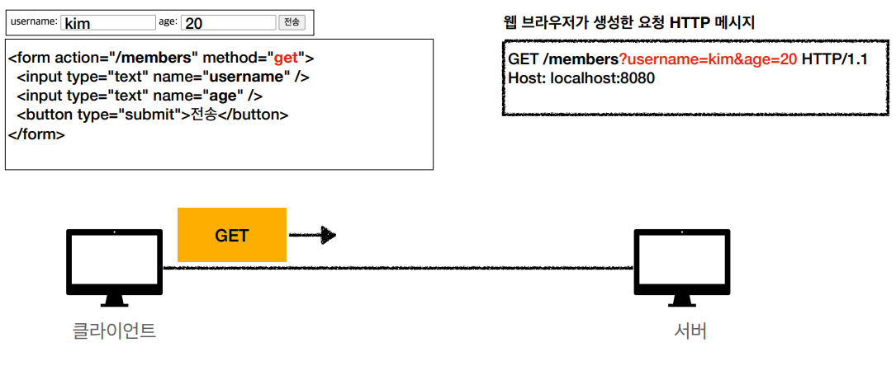

## `POST`
- `전달한 데이터 처리/생성 요청 메서드` [CREATE]
- Message Body를 통해 서버로 요청 데이터를 전달하면 서버는 요청 데이터를 처리하여 업데이트 한다.
- 전달된 데이터로 주로 신규 리소스 등록, 프로세스 처리에 사용한다.

### JSON 데이터 전송 과정
---
1. 클라이언트는 Body에 등록할 회원 정보를 JSON 형태로 만들어 담고 서버로 전송한다.
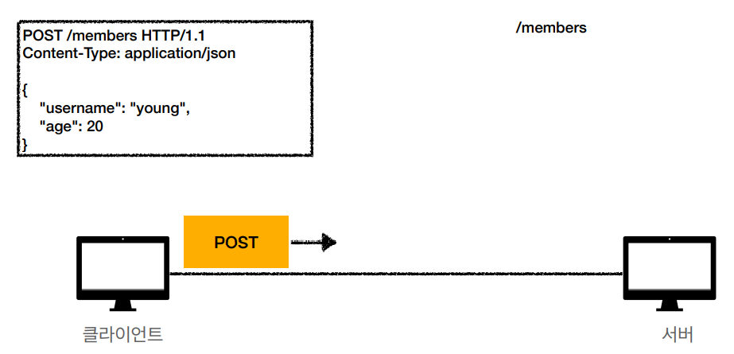

2. 서버에서는 받은 메세지를 분석해 로직 대로 처리 한다. 예를 들어 데이터베이스에 등록하고 신규 아이디를 생성한다.
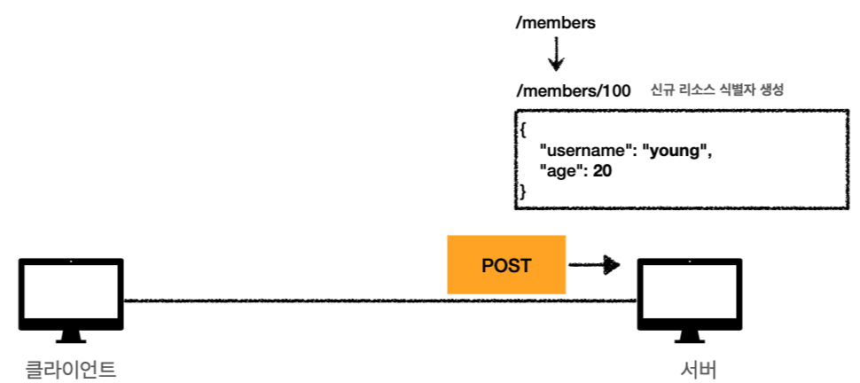

3. 신규회원에 대한 데이터를 Body에 담아서 클라이언트로 응답한다.
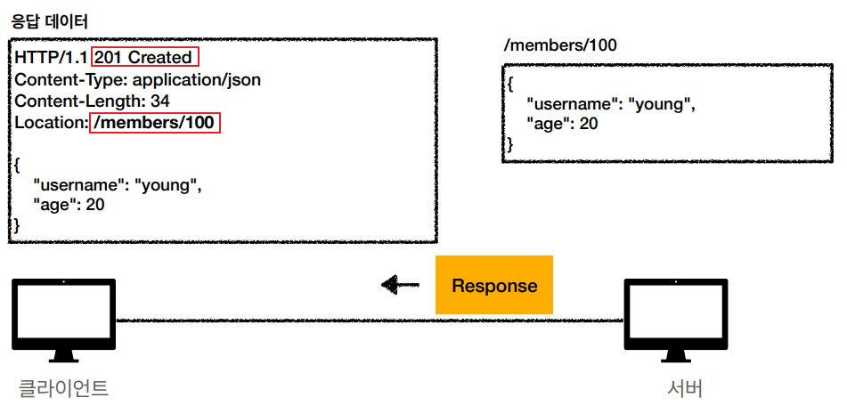

### HTML Form 데이터 전송 과정
---
1. 웹문서에서 폼 입력칸에 데이터를 적고 전송 버튼을 누른다.


2. 지정한 POST 메서드 동작에 따라 input 태그안에 들어간 값들이 쿼리스트링으로 서버로 전송된다.
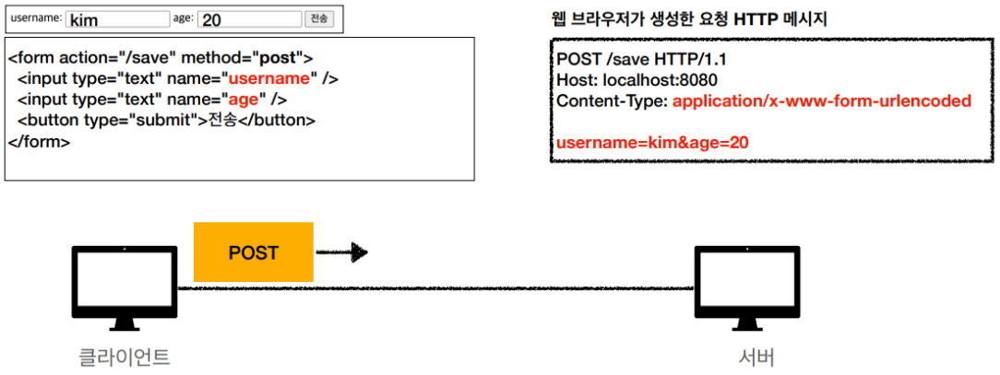

### 파일 데이터 전송 과정
---
- enctype을 `multipart/form-data` 로 작성해 해당 폼에 파일이 있다는 것을 표시한다.
- Binary 데이터 전송시 사용한다.
- `multipart/form-data` 형식이라면 HTTP 메세지에 임의의 구분자(------XXX)가 FORM 데이터간 구분을 지어준다.
- 여러 개의 Content-Type에 대한 데이터를 보낼 수 있다.

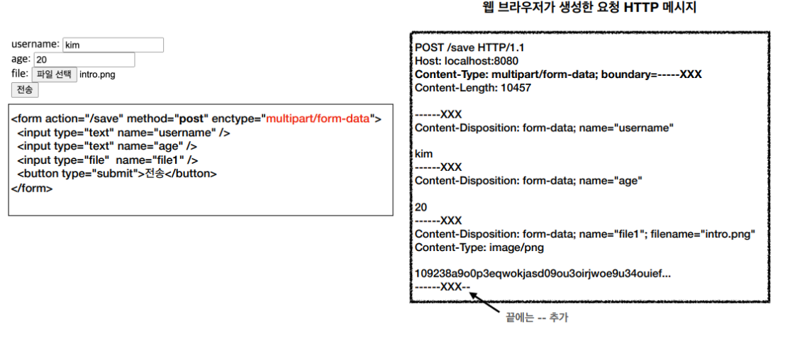

## `PUT`
- `리소스 대체(수정)하는 메서드` [UPDATE]

- 만일 요청 메세지에 리소스가 있으면 덮어쓰고, 없으면 새로 생성한다.
    - 데이터가 존재하면 기존에 것을 완전 대체한다.
    - 데이터가 없으면 대체 할게 없으니 새로 생성한다.
- 데이터를 대체해야 하니, 클라이언트가 리소스의 구체적인 전체 경로를 지정해 보내주어야 한다.

### PUT 요청에 대한 리소스가 있는 경우
---
1. 100번 유저의 리소스를 교체하겠다는 요청을 보낸다.
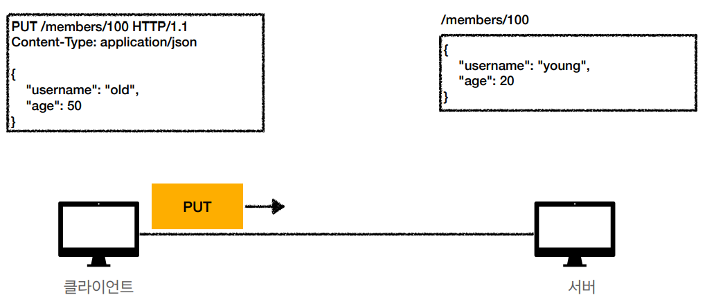

2. 기존에 데이터가 있었다면 완전히 대체된다.
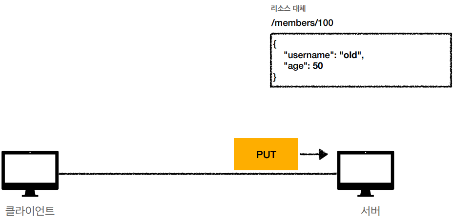

### PUT 요청에 리소스가 없는 경우
---
1. 등록할 100번의 회원 정보를 요청으로 보낸다.
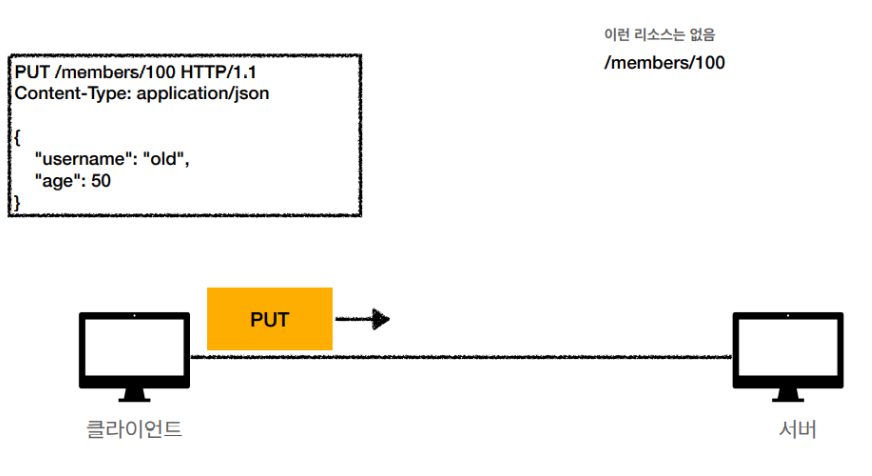

2. 기존에 데이터가 없다면 POST와 같이 신규로 생성한다.
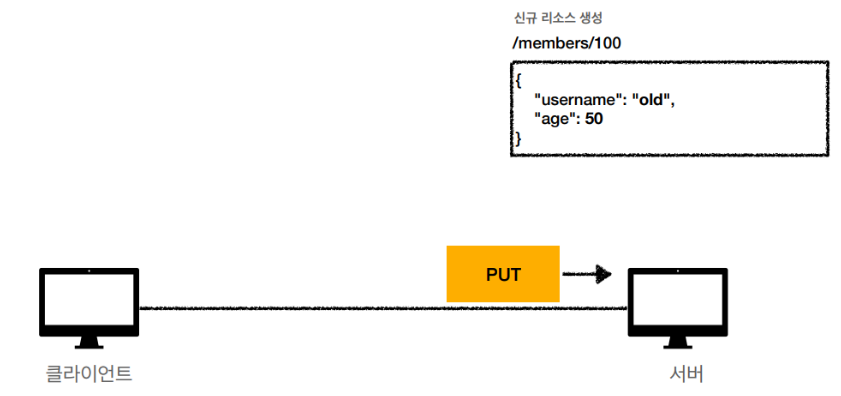

### PUT 요청에 일부 리소스만 변경하길 원할 경우
---
1. 100번 유저의 age만 50으로 변경하려고 해당 데이터를 PUT으로 전달한다.
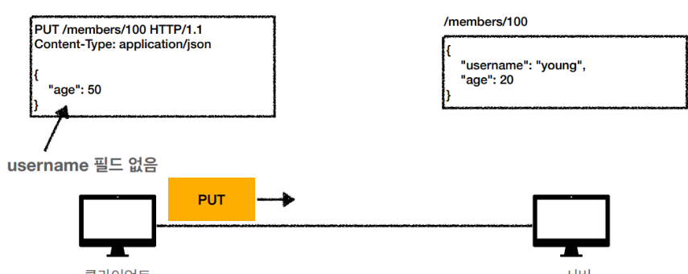

2. 하지만 기존 데이터가 완전히 대체되어 이름 데이터가 삭제된다. (이때는 PATCH 메소드를 이용해야 한다)
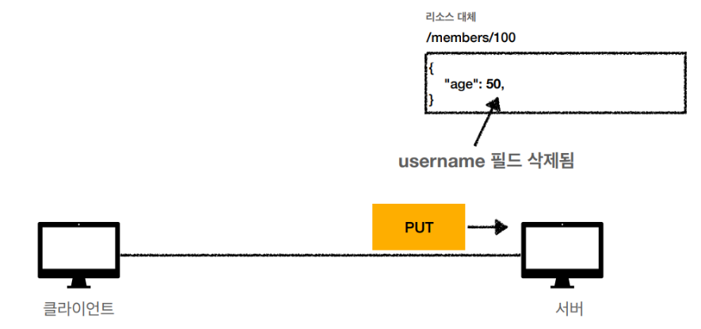

## `PATCH`
- `리소스 일부 부분을 변경하는 메소드`[UPDATE]
- 만일 PATCH를 지원하지 않는 서버에서는 대신에 POST를 사용할 수 있다.
---
1. 100번 유저의 age만 50으로 변경하려고 해당 데이터를 PATCH로 전달한다.
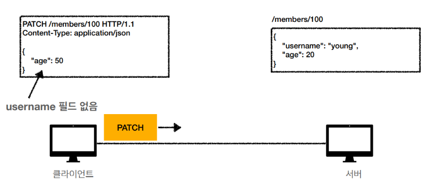

2. PUT과는 다르게 회원 정보에서 age만 변경된다.
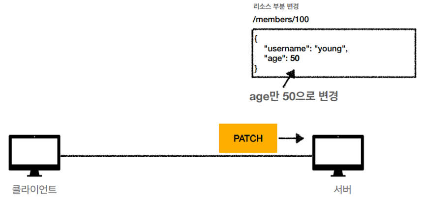

## `DELETE`
- `리소스 제거하는 메소드` [DELETE]
- Status Code는 대부분 200을 사용하고 상황에 따라 204를 사용한다.
---
1. 100번 유저를 제거하기 위해 DELETE로 전달한다.
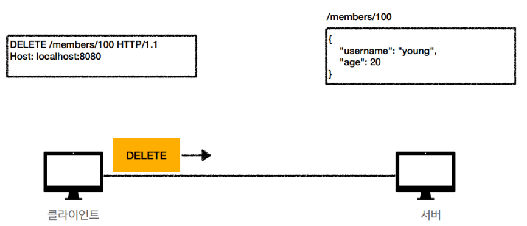

2. 서버에서 요청을 받고 데이터베이스의 해당 리소스를 제거한다.
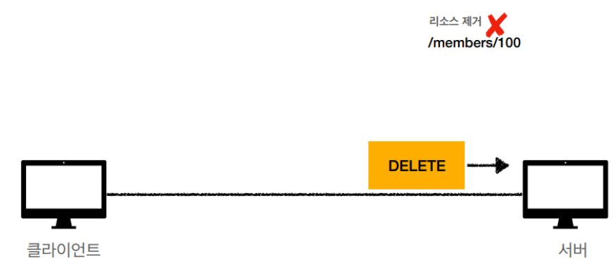

## `HEAD`
- GET과 동일하지만 서버에서 Body를 Return 하지 않는다.
- 응답의 상태 코드만 확인할때와 같이 Resource를 받지 않고 오직 찾기만 원할때 사용 (검사용도)
- 서버의 응답 헤더를 봄으로써 Resource가 수정 되었는지 확인 가능

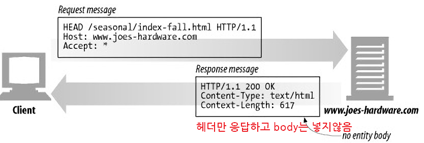

## `TRACE`
- 이 메서드도 일종의 검사용
- 서버에 도달 했을 때의 최종 패킷의 요청 패킷 내용을 응답 받을 수 있다.
- 요청의 최종 수신자는 반드시 송신자에게 200(OK) 응답의 Body로 수신한 메세지를 반송해야 한다.
- 최초 Client의 요청에는 Body가 포함될 수 없다.
```
클라이언트의 요청 패킷이 방화벽, Proxy 서버, Gateway등을 거치면서 패킷의 변조가 일어날 수 있는데, 
TRACE 메서드를 통해 요청했던 패킷 내용과 응답 받은 요청 패킷 내용을 비교하여 변조 유무를 확인 할 수 있다.
```

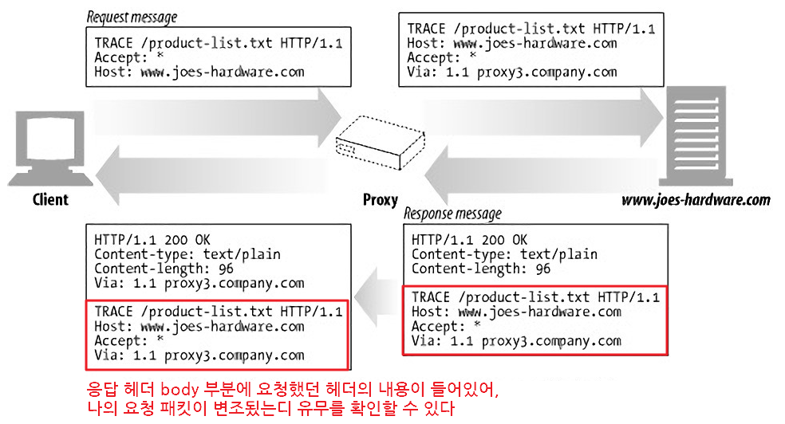

## `OPTION`
- 예비 요청에 사용되는 HTTP 메소드
    - Preflight(예비 요청)이란 본 요청을 하기 전에 안전한지 미리 검사하는 것이라고 보면 된다.
- 서버의 지원 가능한 HTTP 메서드와 출처를 응답 받아 CORS 정책을 검사하기 위한 요청이다.

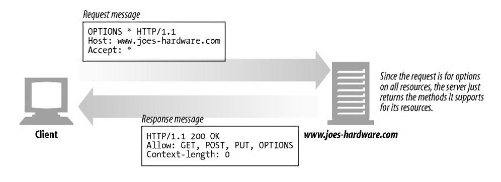

### CORS
```
CORS는 Cross-Origin Resource Sharing의 약자로,
웹 페이지에서 리소스를 다른 도메인에서 요청할 때 발생할 수 있는 보안 정책을 관리하는 메커니즘이다.

기본적으로, 브라우저는 보안 상의 이유로 스크립트에서 다른 도메인에 있는 리소스에 접근하는 것을 제한한다.
이것은 Same-Origin Policy라고 불리는데, 
웹 페이지의 스크립트가 다른 도메인의 데이터에 접근하는 것을 방지하여 사용자의 정보를 보호하는 역할을 한다.

이러한 보안 정책을 우회하고, 특정 출처에서 리소스에 접근할 수 있도록 하는 규약이다.
서버에서 허용된 도메인들에 대해 접근을 허용하는 헤더를 포함시켜 응답하면, 
브라우저는 도메인에서의 요청을 승인하고 데이터를 받아올 수 있게 된다.
```