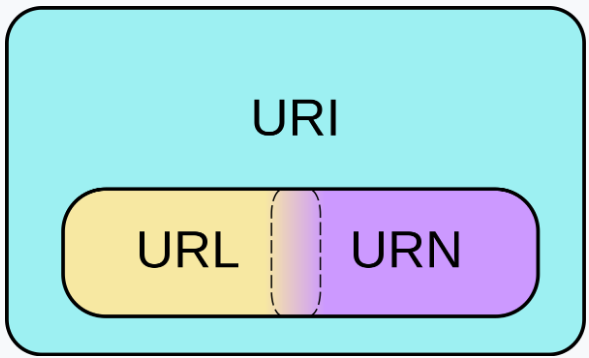
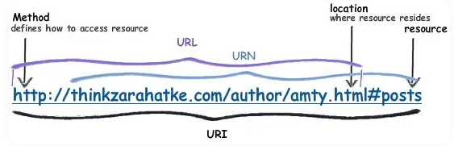

# URI / URL / URN

## URI
- Uniform Resource Identifier
    - Uniform : 리소스를 식별하는 통일된 방식
    - Resource : 자원, URI로 식별할 수 있는 모든 것
    - Identifier : 다른 항목과 구분 / 식별 하는데 필요한 정보
- 목적 : 모든 종류의 리소스에 대한 식별자를 통칭한다.
- 문법 : scheme://[userinfo@]host[:port][/path][?query][$fragment]
- 예시 : https://www.example.com:443/search?q=hello&hl=ko
- 구성 :
  - scheme : 주로 프로토콜을 명시 [ http/https ]
  - userinfo : URL에 사용자정보를 포함해서 인증 -> 거의 사용하지 않음
  - host : 호스트명으로 도메인명이나 IP 주소를 직접 사용 가능
  - port : http 는 80 / https 는 443 , 생략 가능하며 다른 포트도 사용 가능
  - path : 리소스 경로, 보통 계층적 구조를 가지도록 설계
  - query : key=value 형태로 값을 나타냄, query parameter, query string으로 불리며 웹 서버에 보내는 추가적인 질문
  - fragment : html 내부 북마크 등에 사용 (서버에 전송하는 정보는 아님)
- 하위 개념으로 URL과 URN이 있으며, 모두 포함하는 개념
- URI는 리소스를 식별하기 위한 일반적인 개념이며, URL은 그 중에서도 리소스의 위치를 지정하는 특정한 형태

## URL
- Uniform Resource Locator
- 목적 : 리소스의 위치를 지정한다.
- URI의 하위 집합으로 특정 리소스(웹 페이지, 이미지, 동영상 등)가 어디에 위치에 있는지를 나타낸다.
- 예시 : https://www.example.com/page1.html
- 구성 :
  - scheme
  - host
  - path
  - query
- URL은 FTP, SMTP 등 다른 프로토콜에서도 사용할 수 있다.
- URL은 웹 상의 주소를 나타내는 문자열이기 때문에 더 효율적으로 리소스에 접근하기 위해 클린한 URL 작성을 위한 방법론들이 생겨났는데 `REST API`도 그 중 하나이다.

## URN
- Uniform Resource Name
- 목적 : 리소스에 대한 고유하고 지속적인 이름을 제공한다.
- URN 이름만으로 실제 리소스를 찾는 방법이 보편화되지 않았음
    - URI / URL만 우리는 인지하고 있으면 됨
- 구성 : 
  - urn : URN을 나타내는 접두사
  - NID(Namespace Identifier) : URN이 속하는 네임스페이스를 식별한다. 
  - NSS(Namespace Specific String) : 네임스페이스 내에서 리소스를 식별하는데 사용하는 문자열